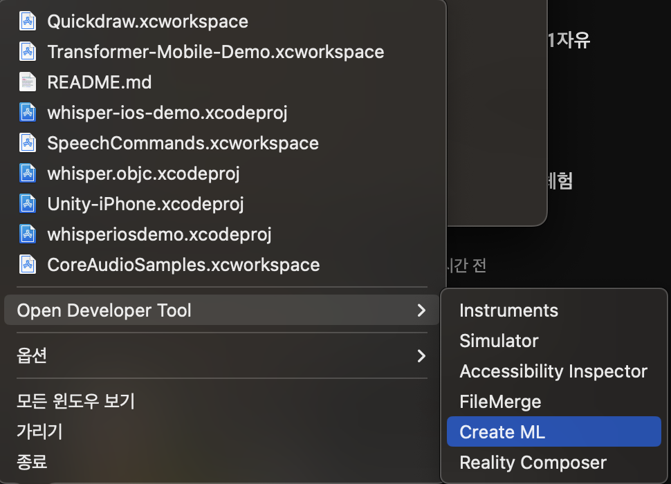
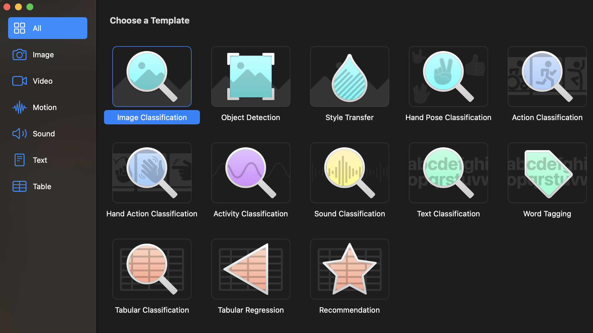
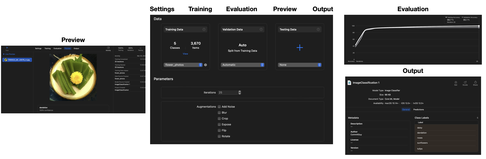
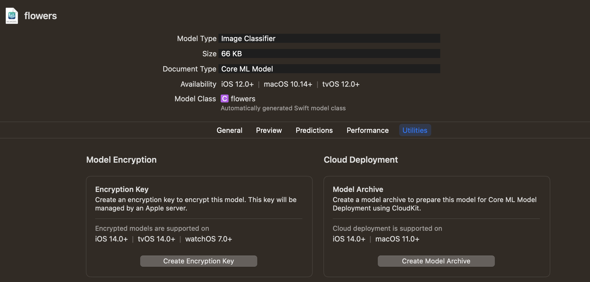
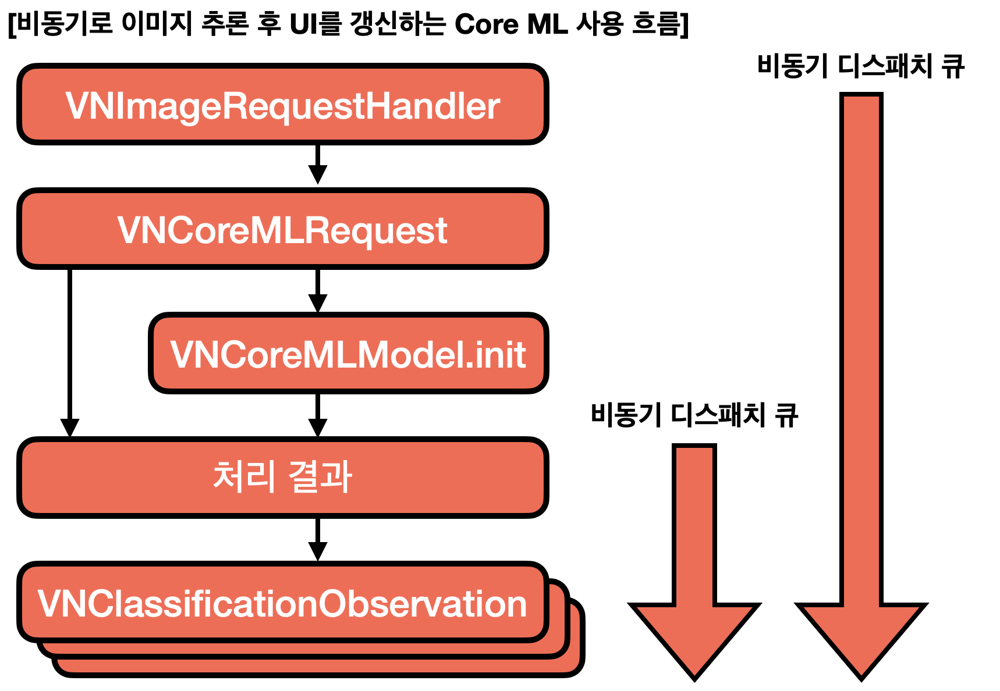

# CreateML & CoreML

## CreateML
- Xcode를 실행 후 mouse 오른쪽 클릭 후 CreateML을 실행

 

- Template 선택

 

- Modeling 편집기

 

  - Settings 탭에서 Training Data 를 설정해 Training 탭에서 학습 시킬 수 있음.
  - Evaluation 탭에서 학습 후 결과를 확인 할 수 있으며
  - Preview 탭에서 테스트 해볼 수 있음
  - Output 탭에서 **[Get]**을 클릭하여 Model을 뽑을 수 있음

CreateML은 전이 학습을 사용하기 때문에 모델을 완전히 처음부터 학습시키는 게 아니며, 그 덕에 모델을 빠르고 효율적으로 학습시키게 됨

## CoreML
- MLModel 파일을 추가하기 위해 Xcode 프로젝트 창에 mlmodel을 Drag & Drop 함

- Utilities 탭에서 모델을 암호화하고 클라우드 배포를 설정할 수 있음
 

### CoreML 추론
CoreML을 사용하면 비동기 추론이 가능해야 하는데 그렇지 못할 경우 모델 추론에서 병목 현상이 일어날 수 있음.  
CoreML은 모바일 API로 설계되어 모델 추론하는 동안 앱이 멈추는 사용자 경험을 제공하지 않도록 하는 패턴을 사용

 

비동기 작업으로 만들기 위해 디스패치 큐(Dispatch Queue)에서 핸들러를 생성
 
CoreML은 CIImage, CGImage, CVPixelBuffer, Data를 입력으로 받을 수 있음