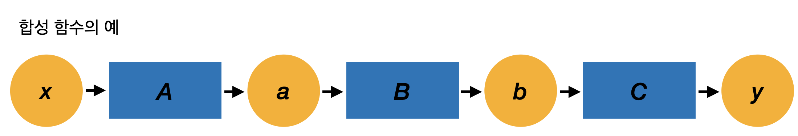
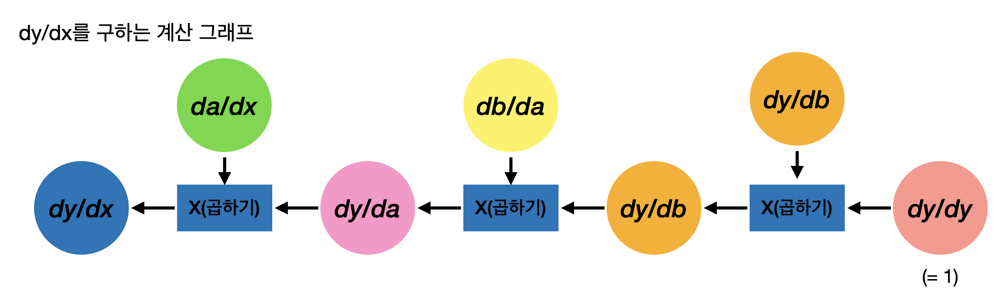
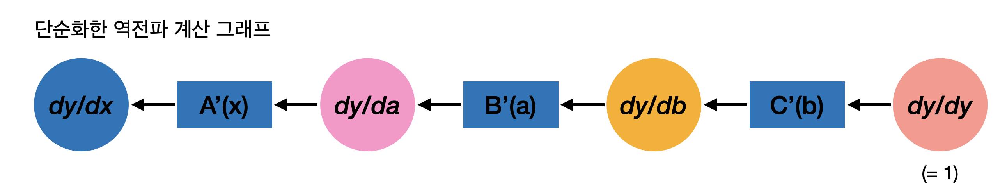
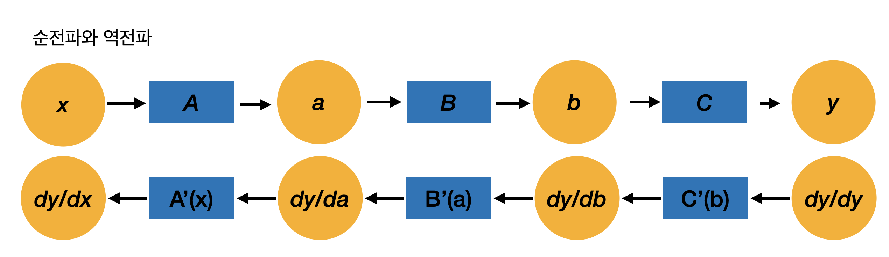

# 역전파 이론
수치미분을 통해 미분 계산이 가능하지만 수치 미분은 계산 비용과 정확도 면에 문제가 있음.
So, 역전파(backpropagation, 오차역전파법)를 이용하면 미분을 효율적으로 계산할 수 있고 결괏값의 오차도 더 적음  

 ## 연쇄법칙(Chain Rule)
 연쇄 법칙에 따르면 합성 함수(여러 함수가 연결된 함수)의 미분은 구성 함수 각각을 미분한 후 곱한 것과 같음  
 
  

 x에 대한 y의 미분은 **"dy/dx = dy/db * db/da * da/dx"** 로 표현할 수 있음.  
 식에서 알수 있듯 x에 대한 y의 미분은 구성 함수 각각의 미분값을 모두 곱한 값과 같음. 즉, 합성함수의 미분은 각 함수의 국소적 미분들로 분해가 가능. --> 연쇄 법칙  

 위 식(dy/dx = dy/db * db/da * da/dx)은 **"dy/dx = dy/dy * dy/db * db/da * da/dx"** 으로도 표현이 가능 dy/dy은 자신에 대한 미분이라 항상 1  

 ## 역전파 원리 도출
**"dy/dx = dy/dy * dy/db * db/da * da/dx"** 은 합성 함수의 미분은 구성 함수들의 미분의 곱으로 분해할 수 있음을 뜻함   
**"dy/dx = (((dy/dy*dy/db)db/da)da/dx)"** 식과 같이 출력에서 입력 방향으로, 즉 보통의 계산과는 반대 방향으로 미분을 계산, 출력 y에서 입력 x 방향으로 곱하면서 순서대로 미분하면 최종적으로 dy/dx가 구해짐  

 

dy/db는 함수 y = C(b)의 미분, db/da = B(a)의 미분, da/dx = A(x)의 미분

 

 "y의 변수에 대한 미분값"이 변수 y, a, b, x에 대한 미분값이 오른쪽에서 왼쪽으로 전파됨을 알 수 있음 이것이 역전파, 전파되는 데이터는 모두 "y의 미분값"

 

순전파와 역전파간의 관계를 봤을때 순전파 시의 변수 a는 역전파 시의 미분 dy/da에 대응, 마찬가지로 b는 dy/db, x는 dy/dx가 대응. 함수에도 마찬가지로 함수 B는 역전파의 B'(a)에 대응 A는 A'(x)에 대응. 이렇게 변수는 '통상값'과 '미분값'이 존재하고 함수는 '통상 계산(순전파)'과 '미분값을 구하기 위한 계산(역전파)'이 존재하는 것으로 생각 가능  

역전파를 구할때 C'(b)는 y = C(b)의 미분값, 이 때 C'(b)계산을 위해선 b값이 필요 마찬가지로 B'(a)를 구하기 위해선 a의 값이 필요함. 즉, 역전파 시에는 순전파 시 이용한 데이터가 필요함 따라서 역전파를 구하기 위해선 먼저 순전파를 해야 함  

## Code
- code
    - step01.py: 수동 역전파 구현
    - step02.py: 자동 역전파 구현 - 1
    - step03.py: 자동 역전파 구현 - 2

## Reference
- 역전파 이론 : [Backpropagation Theory](../../Theory/03_Backpropagation/README.md)
- 역전파 구현 : [Python으로 역전파 구현](code/step03.py)