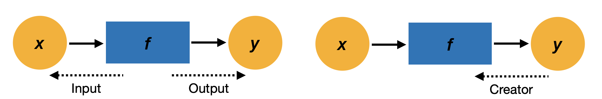

# 역전파 자동화
변수와 함수의 관계를 설정.  

- 함수 관점에서 변수는 "입력"과 "출력"
- 변수 관점에서 함수는 "창조자 혹은 부모"

 

## 역전파 계산의 흐름
1. 함수를 가져온다
2. 함수의 입력을 가져온다
3. 함수의 backward 메서드를 호출한다

 
이러한 똑같은 처리 흐름의 반복을 자동화 하는 코드(step02.py --> step03.py) 