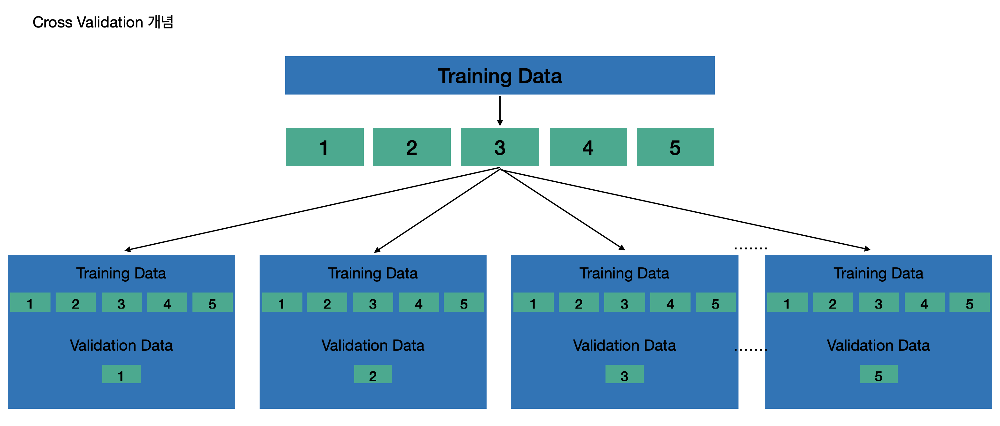

# Pytorch Pretrain Skill

## Tensor
텐서란 데이터를 표현하는 단위

## Autograd
Pytorch를 이용해 코드를 작성할 때 [BackPropagation](../../Theory/03_Backpropagation/README.md)을 이용해 파라미터를 업데이트 하는 방법은 Autograd 방식으로 쉽게 구현할 수 있도록 설정

## 과적합
### 과적합의 원인
#### 학습할 샘플 데이터 수의 부족
모집단에 해당하는 데이터를 갖고 있지 않고 가지고 있는 샘플 데이터를 통해 모집단을 예측해야 함. 즉, 예측하고자 하는 데이터도 결국 전체 집단의 데이터에 속하게 됨. 즉, 학습할 데이터의 수가 많을수록 모집단의 특성을 잘 반영할 확률이 높음

#### 풀고자 하는 문제에 비해 복잡한 모델을 착용
간단한 문제에 대해서는 간단한 모델 또는 적은 변수만을 사용하여 과적합될 가능성을 줄일 수 있음.  
모델이 복잡하다는 표현은 많은 변수를 사용하는 것 또는 모델 자체가 복잡한 모델이라는 것을 의미  

예를 들어 특정 사람의 몸무게를 예측하는 모델을 만드는 상황이라 가정시 '키'라는 변수만으로 예측하는 것이 아닌 '머리카락의 색상', '눈의 크기', '손톱의 길이' 등과 같은 변수를 추가하게 되면 과적합될 가능성이 높아짐 

#### 적합성 평가 및 실험 설계(Training Validation Test Cross Validation)
과적합을 방지하는데에는 여러 방법이 존재  

가장 이상적인 방법은 데이터의 수를 늘려 모집단의 특성을 잘 반영한 데이터를 확보하고 풀고자 하는 문제에 적합한 모형을 선택하는 것  

But, 현재 만든 모형이 과적합됐는지 아는것 자체가 쉽지 않음, 그렇기에 가지고 있는 데이터를 분할해 만든 모델의 과적합 정도를 판단해야 함. 이 과정을 **실험 설계를 통한 적합성 평가** 라고 함.  
갖고 있는 데이터를 적절히 학습 데이터와 검증 데이터로 분할하고 학습 데이터로 학습 후 검증 데이터에 모델을 적용시켜 과적합 여부를 판단  

실험 설계 과정: 가지고 있는 데이터를 '학습', '검증', '테스트 데이터'로 랜덤하게 분할 이때의 비율은 기본적으로 4:3:3 정도로 분할  

- **학습 데이터**: 말 그대로 '학습용 데이터'를 의미
- **검증 데이터**: 학습 데이터를 적합시킨 함수를 검증시킬 데이터를 의미, 검증 데이터(Validation Data)의 성능 지표를 보며 최적의 파라미터를 선택. 즉, **검증 데이터는 만든 모델의 파라미터를 설정해 검증하는 용도로 사용**
- **테스트 데이터**: 만든 모델의 성능을 최종적으로 측정하는 데이터. 검증 데이터와 테스트 데이터의 다른 점은 테스트 데이터는 우리가 전혀 보지 못한 데이터라 가정. 검증 데이터는 모델의 성능을 높이기 위한 과정에 있는 파라미터 설정을 위한것이기에 어느 정도 알고 있다는것을 전제로 함 But, 테스트 데이터는 만든 모델을 실제 적용시 이 정도의 성능이 나온다고 이야기하는 데이터 So, **테스트 데이터는 실험 설계 과정에서 전혀 보지 못한 데이터라 가정해야 함**

  
#### K-Fold Cross Validation
가지고 있는 데이터가 많지 않은 경우 데이터 분할 자체가 매우 부담이 될 수 있음. 학습 데이터의 수가 많지 않을 때에는 K-Fold Cross Validation 기법을 사용 
가지고 있는 데이터를 랜덤하게 K개의 Fold로 구분(K는 하이퍼 파라미터로 보통 5~10으로 설정)   

K개의 Fold로 데이터를 랜덤하게 분할한 후 첫번째 Fold를 제외한 나머지 Fold 데이터를 합쳐 학습 데이터로 사용하고 첫 번째 Fold를 검증 데이터로 사용, 두번째 Fold를 검증 데이터로 사용하고 두번째 Fold를 제외한 나머지 Fold 데이터를 학습 데이터로 사용. 이렇게 K 번 반복하여 결국 모든 데이터를 학습 데이터와 검증 데이터로 사용, 각 Fold를 검증데이터로 사용해 성능을 측정하고 전체 Fold에 대한 성능을 평균내면 현재 만든 모델의 평균 성능 측정이 가능해짐 

## 성능 지표
만든 모델의 성능을 측정 해야함. 일반적으로 학습하는 모델은 Loss를 줄이기 위해 학습. 사용자의 선택에 따라 Loss와 성능 지표를 같게 설정할 수도 있고 다르게 설정 할 수도 있음  

- MSE(Mean Squared Error): 기본적으로 회귀 모형에서 많이 사용하는 Loss이자 성능 지표. 예측 값과 실제 값의 차이에 대해 평균 제곱합의 개념. 낮을수록 좋은 성능 지표
- MAPE(Mean Absolute Percentage Error): MSE는 상대적 성능 지표(1 문제에 대해 A 모델의 MSE가 30, 2문제에 대해 B 모델의 MSE가 3000이 나왔다고 A 모델이 좋다고 할 수 없음). 같은 문제에 대해 다른 모델을 적용했을 때만 비교가 가능.  
MAPE는 MSE에 비해 절대적 지표, 예측 값과 실제 값의 차이를 실제 값으로 나눠 실제 값 대비 몇 % 정도의 오차가 있는지에 대한 성능 지표
- 정확도(Accuracy): 분류 문제에서 가장 많이 사용하는 성능 지표. 전체 데이터 중 실제로 잘 예측했는지에 대한 비율을 의미. But, 실제 데이터 분석을 해야하는 경우 클래스 간의 불균형 현상이 있음. 정상의 비율이 99%, 불량의 비율이 1%인 Class Imbalanced Problem이 존재. 이러한 경우 성능 지표로 Accuracy를 사용할 경우 모두 정상이라 예측해버리면 99%의 매우 좋은 모델이라 잘못 생각할 수 있음
- F1-Measure(F1-score): Class Imbalance상황에서 많이 사용하는 성능지표

 

## Notes
DeepLearning의 학습 과정  
1. Input과 Weight를 곱한 후 활성화 함수를 사용하여 예측값을 만듬
2. 실제 값과 예측값의 차를 활용한 오차 함수를 만듬
3. 역전파를 계산하여 가중치들을 업데이트