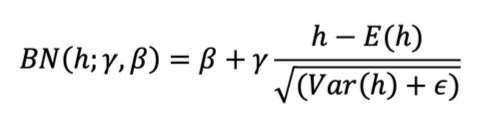
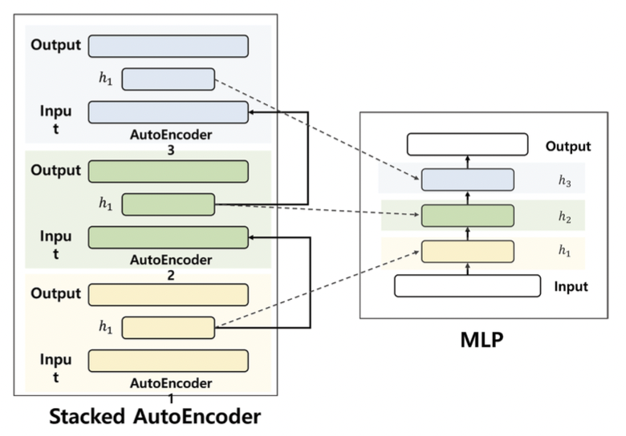

## Dropout
과적합 방지를 위한 방법  

#### [CODE] **0_MultilayerPerceptron_MNIST.ipynb**에 **test03_Dropout.py** 참조

## Activation 함수 
Activation 함수는 어떤 신호를 입력받아 이를 적절히 처리해 출력해주는 함수  

MLP에서 기본적으로 sigmoid 함수를 사용하지만 Back Propagation 과정 중에 시그모이드를 미분한 값을 계속 곱해주면서 Gradient 값이 앞 단위의 Layer로 올수록 0으로 수렴하는 현상이 발생 --> Gradient Vanishing  

Hidden Layer가 깊어질수록 심해지기에 Hidden Layer를 깊게 쌓아 복잡한 모델을 만들 수 있다는 장점이 의미가 사라짐  

### ReLU 함수
ReLU(Rectified Linear Unit) 함수는 기존의 Sigmoid 함수와 같은 비선형 활성 함수가 지니고 있는 문제점을 어느 정도 해결한 활성 함수. ReLU가 Sigmoid에 비해 좋은 이유는 이 활성 함수를 미분할 때 입력 값이 0 이상이 부분은 기울기가 1, 입력 값이 0 이하인 부분은 0이 되기 때문에 BackPropagation 과정 중 곱해지는 Activation 미분 값이 0또는 1이 되기 때문에 아예 없어지거나 완전히 살리는 것으로 해서될 수 있음
--> Hidden Layer가 깊어져도 Gradient Vanishing이 일어나는 것을 완화시키며 Layer를 깊게 쌓아 복잡한 모형을 만들수 있게 되어짐  

#### [CODE] **0_MultilayerPerceptron_MNIST.ipynb**에 **test04_ReLU.py** 참조

## Batch Normalization
신경망에는 과적합과 Gradient Vanishing 외에도 Internal Covariance shift라는 현상이 발생  

**Internal Covariance shift** 란, 각 Layer마다 Input 분포가 달라짐에 따라 학습 속도가 느려지는 현상 --> **Batch Normalization** 은 이를 방지하기 위한 기법으로 Layer의 Input 분포를 정규화해 학습 속도를 빠르게 하는 것  

 
- h: input 분포 
- Beta와 Gamma는 각각 분포를 shift시키고 Scaling시키는 값으로 Back Propagation을 통해 학습 

 

#### [CODE] **0_MultilayerPerceptron_MNIST.ipynb**에 **test05_BatchNormalization.py** 참조

 

## Initialization
신경망은 처음에 Weight를 랜덤하게 초기화하고 Loss가 최소화되는 부분을 찾아감. 그러나 신경망을 어떻게 초기화하느냐에 따라 학습 속도가 달라짐 그렇기 때문에 신경망의 초기화 기법에 대해 다양한 연구가 이뤄지는 중

### 대표적 초기화 기법
#### LeCun Initialization
#### He Initialization
ReLU 함수를 사용시 초기화를 보완하기 위한 기법

 

#### [CODE] **0_MultilayerPerceptron_MNIST.ipynb**에 **test06_Initialization.py** 참조

 

## Optimizer
Batch 단위로 Back Propagation 하는 과정을 Stochastic Gradient Descent(SGD, 확률적 경사 하강법)라 하고 이러한 과정을 **'Optimization'** 이라 함  

SGD 외에도 SGD의 단점을 보완하기 위한 다양한 Optimizer가 존재

### 다양한 Optimizer
- **Momentum** : 미분을 통한 Gradient 방향으로 가되, 일종의 관성을 추가하는 개념. 일반적 SGD는 조금씩 최적 해(Global Optinum)을 찾아감. 전체 데이터에 대해 Back Propagation을 하는 것이 아닌 Batch 단위로 BackPropagation하기 때문에 일직선으로 찾아가지 않음  
But, Momentum을 사용하면 최적의 장소로 더 빠르게 수렴. 걸어가는 보폭을 크게하는 개념 또한 최적해가 아닌 지역해(Local Minimum)을 지나칠수도 있다는 장점이 존재
- **Nesterov Accelerated Gradient(NAG)** : Momentum을 약간 변형한 방법
- **Adaptive Gradient(Adagrad)** : Adagrad의 개념은 가보지 않은 곳은 많이 움직이고 가본 곳은 조금씩 움직이자
- **RMSProp** : Adagrad의 단점을 보완, Adagrad의 단점은 학습이 오래 진행될수록 부분이 계속 증가해 Step size가 작아지는 것인데 RMSProp는 G가 무한히 커지지 않도록 지수 평균을 내 계산
- **Adaptive Delta(Adadelta)** : Adadelta 또한 Adagrad의 단점을 보완한 방법
- **Adaptive Moment Estimation(Adam)** : Adam은 딥러닝 모델을 디자인할 때 기본적으로 가장 많이 사용하는 Optimizer, RMSProp와 Momentum 방식의 특징을 결합한 방법. 2020년 기준으로 많은 딥러닝 모델에서 기본적으로 Adam을 많이 사용
- **Rectified Adam optimizer(RAdam)** : Adam 뿐 아니라 대부분의 Optimizer는 학습 초기에 Bad Local Optimum에 수렴해 버릴 수 있는 단점이 존재, RAdam은 이러한 문제를 교정하는 Optimizer

 

#### [CODE] **0_MultilayerPerceptron_MNIST.ipynb**에 **test07_Optimizer.py** 참조

 

## AutoEncoder(AE)
AutoEncoder(AE)는 대표적인 비지도 학습 신경망 모델로 Input과 Output을 똑같이 설정  

Hidden Layer의 앞부분을 인코더(Encoder), 뒷부분을 디코더(Decoder)라 함  
Input Data에 대해 Hidden Layer로 인코딩한 후 다시 원래 Input Data로 디코딩하는 개념으로 AE의 학습 과정은 데이터를 원래의 데이터로 잘 복원하도록 학습시키는 것.  

자기 자신을 잘 복원할 수 있는 모델이라는 의미는 복원하는 과정 중에 있는 압축했을 때의 Feature는 Feature로서의 의미가 있을것이라 이해할 수 있음

### Stacked AutoEncoder(SAE)
Stacked AutoEncoder(SAE)는 말 그대로 AE를 쌓아 올린 모델  

AE의 새로운 Feature가 Feature로서의 의미가 있다면 이를 쌓아 올려 학습하면 더 좋은 학습 모델을 만들 수 있을 것이라는 생각  

 

1. Input Data로 AE1을 학습
2. 1 에서 학습된 모형의 Hidden Layer를 Input으로 해 AE2를 학습
3. 2 과정을 원하는 만큼 반복
4. 1~3에서 학습된 Hidden Layer를 쌓아 올림
5. 마지막 Layer에 Softmax와 같은 Classification 기능이 있는 Output Layer를 추가
6. Fine-tuning으로 전체 다층 신경망을 재학습

 

**Fine-tuning** 이라는 개념은 따로 학습시킨 모델을 재학습 시키는 개념
 

SAE의 개념은 좋은 Feature를 지니고 있는 Hidden Layer를 쌓아 네트워크를 학습시키면 더 좋은 모델을 만들 수 있을 것이다 라는 것  

미리 학습시키는 것을 **Pre-Trained Model** 이라 하고 이 모델을 재학습 시키는 것을 **Fine-tuning** 이라 함 

### Denoising AutoEncoder(DAE)
Denoising AutoEncoder(DAE)는 좀 더 강건한 Feature를 만들기 위한 AE 

AE와 마찬가지로 Input 데이터를 잘 복원하도록 학습시키는 모델이지만 Input에 약간의 Noise를 추가해 학습 시킴. 즉, Input이 x + noise이고 Output이 x인 것. Input Data에 Noise를 주어 학습시킴으로써 어떤 데이터가 Input으로 오든 강건한 모델을 만들겠다는 것.  

Stacked Denosing AutoEncoder(SDAE)는 SAE에서 AE를 DAE로 대체한 것 

#### [CODE] **1_AutoEncoder.ipynb** 참조