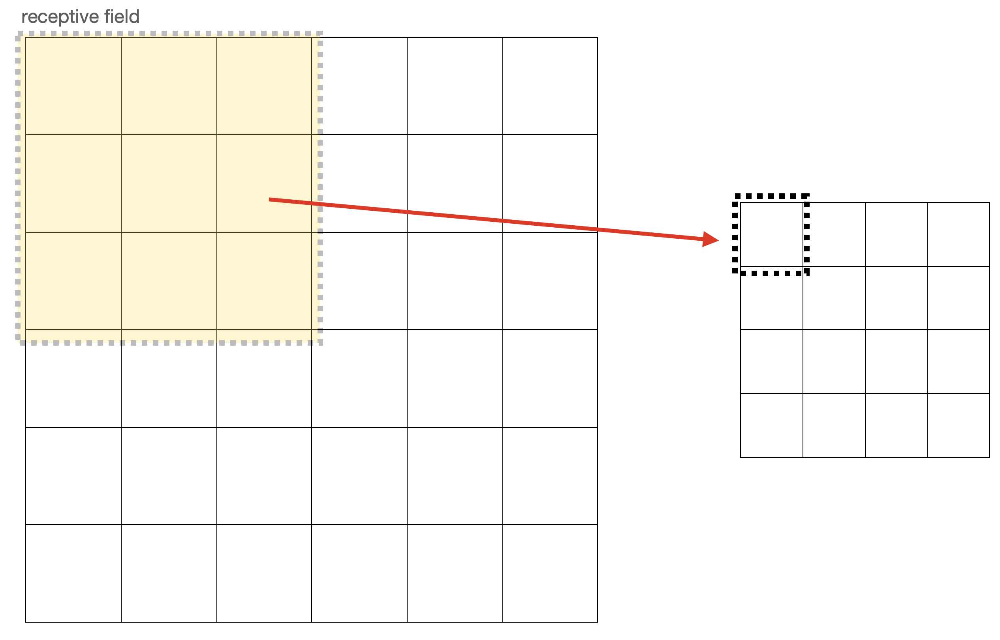
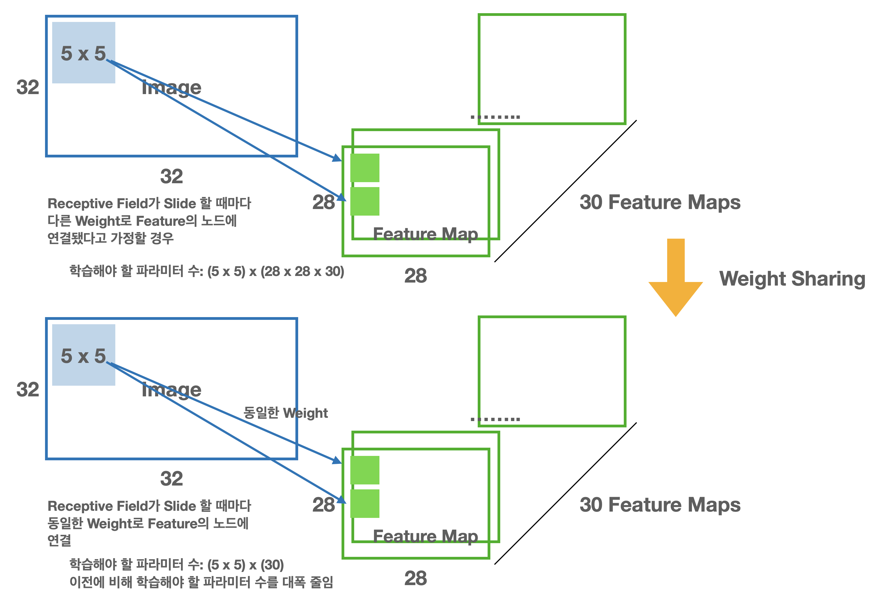
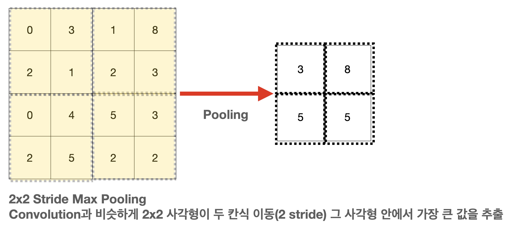
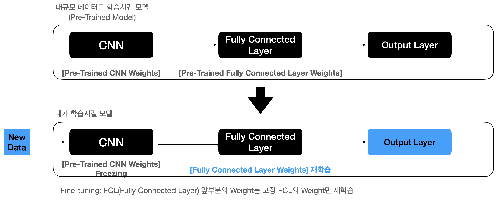

# Computer Vision
## CNN(Convolutional Neural Network)
일반적인 Machine Learning을 할 때 Input 변수가 서로 독립적이라는 가정하에 실행 --> 독립변수(Independent Variable)  

But, 이미지 데이터의 경우 각 픽셀값이 서로 독립적이 아님 인접한 픽셀들은 서로가 매우 가까운 값을 가지기 마련  

- **Region Feature** : 이미지 픽셀 값을 단순 Flatten하여 사용하게 되면 가까운 위치의 픽셀값에 대한 정보를 반영하지 못함 --> 지역 정보(Region Feature)를 학습할수 있는 신경망 구조의 필요에 의해 탄생한 것이 CNN  
- **CNN** : CNN은 Region Feature를 학습시키기 위한 신경망 모형, CNN은 Region Feature를 뽑아내는 Convolution Layer, Feature Dimension을 위한 Pooling Layer 그리고 최종 분류를 위한 (일반적 MLP 구조를 지니는) Fully Connected Layer로 구성  
- **Convolution Layer** : Convolutional Layer는 Receptive Field를 정의해 입력 층의 이미지의 Feature를 추출하는 역할을 담당, 이미지가 Input으로 들어왔을 때 사각형 모양의 Receptive Field가 이미지를 스캔하며 이미지의 Region Feature를 추출
 

- **Stride** : Stride는 Convolution Layer에서 Receptive Field가 이미지를 돌면서 Feature를 뽑을 때 이동하는 칸 수를 의미 
- **Padding** : 5x5 이미지에 3x3 Convolution을 적용하면 3x3 이미지로 줄어들게 됨. 이와 같이 일반적인 Convolution을 적용시 다음 Image 또는 Feature의 Size가 줄어들고 가장자리에 있는 픽셀값은 안쪽에 있는 픽셀 값보다 적게 Convolution이 적용되는 단점이 존재. --> Image Size는 줄이지 않고 모든 픽셀 값에 Convolution을 적용하기 위해 Padding이라는 개념을 적용.  

- **Weight Sharing** : Convolution Layer에서 Receptive Field를 움직여가며 다음 Feature Map을 추출할 때 다른 Weight로 Feature를 추출하려면 매우 많은 파라미터를 학습 해야함   
예를 들어 32x32 image에 5x5 Convolution을 적용하고 30개의 Feature Map을 뽑겠다 정의시 60 만개 정도의 파라미터를 학습해야 함 --> 이러한 문제를 해결하기 위해 **Weight Sharing** 기법 사용. Weight Sharing은 Weight를 공유하는 개념 한 이미지에서 Receptive Field를 옮길 때마다 같은 Weight를 사용  

- **Pooling Layer** : Image 또는 Feature의 Convolution을 거친 후에 Pooling layer를 거침, Pooling의 개념은 Feature Size를 반으로 줄여주는 것. Pooling Layer를 거치지 않으면 많은 파라미터를 학습시켜야 하기 때문에 학습 시간이 오래 걸릴 수 있음. 즉, Pooling Layer의 개념은 CNN의 학습 속도를 향샹시키기 위해 Feature Dimension을 줄이는 개념 사각형 안에 픽셀 값을 뽑으면 **Max Pooling** , 평균 픽셀 값을 뽑으면 **Average Pooling**  
Pooling의 목적은 CNN 학습 속도 향샹으로 Feature의 Dimension을 줄이기에 정보 손실 발생  

 

## CNN & MLP
CNN과 MLP의 가장 큰 차이점은 이미지의 Feature를 어떻게 추출하느냐. CNN이 MLP보다 성능이 더 좋은 이유는 단지 Region Feature를 추출하기 때문 즉, Feature를 어떻게 하느냐가 딥러닝 성능에 중유  

- [CODE] 1_CNN_ImageClassification.py

## Data Augmentation
데이터를 임의로 변형해 데이터의 수를 늘려 다양한 Feature를 뽑는 방법을 **Data Augmentation** 이라 함 
일반적으로 이미지 분류 문제에서 Data Augmentation을 할 경우에 성능이 소폭 상승

### Data Augmentation 기법
- Random Flip/Rotation/Cropt/Scaling
- Cutout/Cutmix
  - Cutout: 이미지의 일부를 사각형 모양으로 검은색을 칠하는 기법, 숫자로는 0을 채워 넣는 것. 일종의 Input 데이터에 Dropout을 적용한 기법
  - Cutmix: 두 이미지를 합쳐놓고 이미지의 Label을 학습시킬 때 각가긔 이미지가 차지하는 비율만큼 학습시키는 방법

- [CODE] 2_CNN_ImageClassification_Augmentation.py

## Transfer Learning
학습하고자 하는 데이터의 갯수가 많지 않은 경우 ImageNet 데이터를 미리 학습해 놓은 딥러닝 모델(Pre-Trained Model)을 가져와 재학습(Fine-tuning)시키는 방법을 사용 --> 이러한 방법을 **전이 학습(Transfer Learning)** 이라 함  

Pre-Trained Model을 로드한 후 Fully Connected Layer 앞단 네트워크의 Weight를 가져오고 Fully Connected Layer을 디자인  

Fully Connected Layer도 그대로 사용하고 Output Layer만 디자인하기도 함. Pre-Trained Model은 우리가 풀고자 하는 문제보다 훨씬 큰 문제를 푸는 모델이기 때문에 Output Layer의 Dimension을 수정해야 함. 그리고 우리가 보유한 데이터를 Input으로 해 학습을 진행. 일반적으로 Pre-Trained Model의 Fully Connected Layer 이전의 Weight는 학습시키지 않음  

--> Weight를 Freezing 한다 표현하며 보유하고 있는 데이터를 갖고는 Fully Connected Layer 부분의 Weight만 학습을 진행 --> 이 과정을 Fine-tuning이라 함  

Transfer Learning은 결국 내가 학습하고자 하는 모델의 초기 Weight에 Pre-Trained Model의 Weight를 사용하는 것과 같기 때문에 Initialization 기법으로 바라볼 수도 있음
 

 

- [CODE] CNNImageClassify_TransferLearning.ipynb