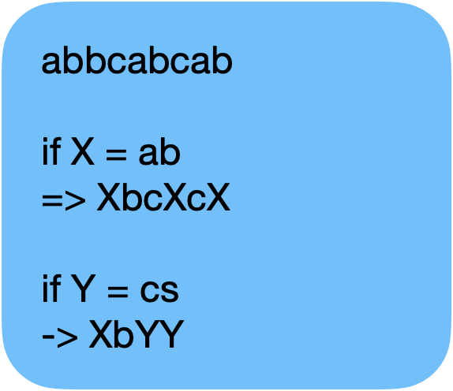
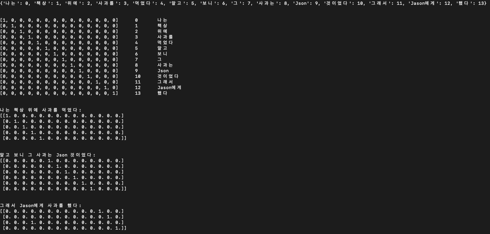
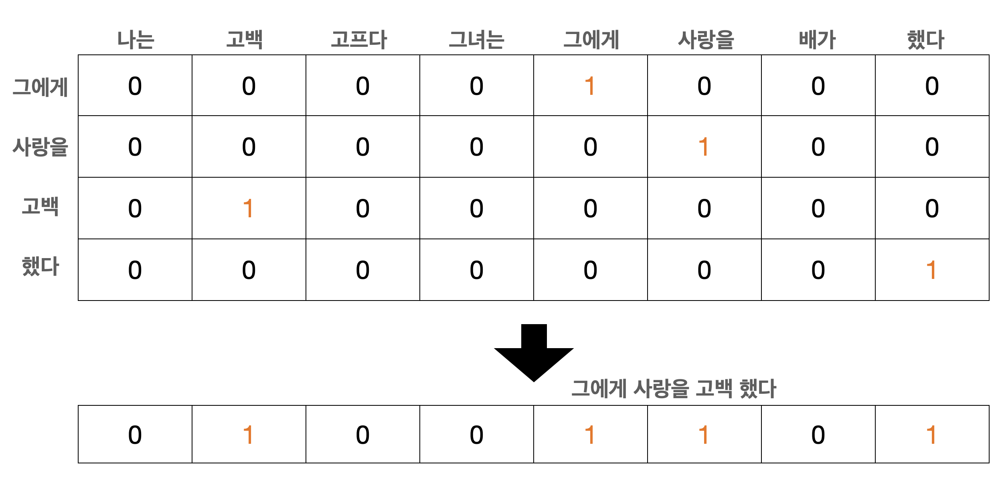
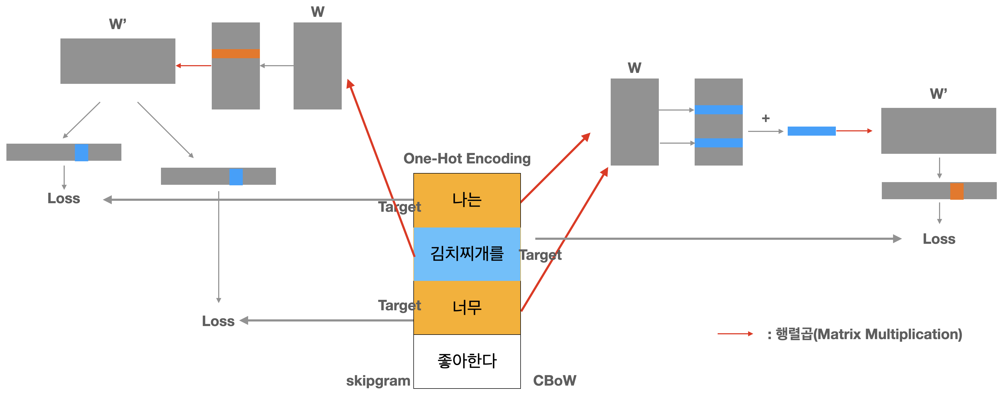

# NLP
Text 데이터를 분석하고 모델링하는 분야를 자연어 처리(NLP)라 함 <br>
- NLP(Natural Language Processing, NLP): 자연어 처리
  - NLU(Natural Language Understanding, NLU): 자연어 이해
    - Text -> Meaning
  - NLG(Natural Language Generation, NLH): 자연어 생성
    - Meaning -> Text

<br>

torchtext를 이용해 데이터셋 불러오기
```
from torchtext import data
from torchtext import datasets

# Data Setting
TEXT = data.Field(lower=True, batch_first=True)
LABEL = data.Field(sequential=False)

train, test = datasets.IMDB.splits(TEXT, LABEL)
```

## 문자를 숫자로 표현
문자를 단순하게 숫자로 바꿔버리는 경우 Input에서 공통적인 패턴(Pattern) 또는 특징(Feature)을 찾기 힘듬 <br>
모델을 잘 만들기 위해서는 Input의 공통적 패턴을 잘 찾아내도록 해줘야 함

단순하게 문자를 숫자로 바꿔 버리게 되면 몇 가지 문제가 생김 <br>
- 내가 만든 사전에 없는 단어가 나오는 경우
- '철수'나 '철수에게'는 같은 단어 같은데 조사 차이로 나눠야 하는가?
- 이중적 의미의 단어(예] 사과)를 같게 처리하는 경우

### Corpus & Out-of-Vocabulary(OOV)
Token을 저장해둔 Vocabulary에 Token이 없어서 처음 본 Token이 나오는 현상을 Out-of-Vocabulary(OOV)라 함 <br>
이런 상황을 대비해 특수한 Token을 만들어 사용(<unk> token)

새로 나온 단어마다 <unk> Token으로 처리하는 것보다 애초에 사전을 풍부하게 만들면 OOV 문제는 해결됨 --> 그러기 위해선 다양한 Token을 많이 모을 수 있는 많은 문장이 필요. Token을 모으기 위해 모아 놓은 문장의 모음을 **말뭉치(Corpus)** 라 함

Corpus를 잘 만드는 것도 모델 성능 향상의 큰 요인

하지만 Corpus가 커질수록 사전의 크기 역시 커짐. 사전의 크기가 커질수록 만드는 모델의 사이즈도 커지게 됨. 너무 커질 경우 메모리에 부담을 주게됨

===> 효율적인 Token 사전을 만들려면 띄어쓰기보다 좋은 Tokenizer가 필요

### Byte Pair Encoding(BPE)
띄어쓰기는 가장 쉬운 방법이긴 하지만 일상의 언어를 분석하는 과정에서는 비효율적 방법

한국어의 단위는 길이 순으로 **음운 < 음절 < 형태소 < 단어 < 어절 < 문장**
- 음운: 말의 뜻을 구별해주는 소리의 단위 (예: ㅎ, ㅏ, ㄴ, ㄱ, ㅜ , ㄱ)
- 음절: 음의 한 마디(예: 한 국)
- 형태소: 의미를 지닌 최소의 단위
- 단어: 최소의 자립 형식(예: 먹었다)
- 어절: 문장을 이루는 마디, 문장 성분의 최소 단위로서 띄어쓰기의 단위
- 문장: 사고나 감정을 말로 표현할때 완결딘 내용을 나타내는 최소 단위

#### Character based tokenization
띄어쓰기가 아닌 글자(Character)를 Token으로 사용

Token 사전의 크기가 줄어듬. 한국어에서는 자음과 모음으로 나타낼 수 있는 모든 조합을 생각하면되고 영어에서는 소문자 기준 26개의 알파벳만 생각하면 됨

OOV 현상은 사실상 없앨수 있게 됨. 인터넷에서 만들어지는 단축어와 신조어 등의 모든 글자를 표현할 수 있음

하지만 실제 딥러닝 모델에서 사용하는 Token은 대부분 글자 단위가 아님. 글자 단위의 Tokenization의 문제 중 하나는 표현법에 대한 학습이 어렵다는 것. 글자 하나는 보통 특정 의미를 갖고 있지 않음

특정 글자의 연속된 나열이 특정 의미를 나타내고 이를 패턴으로 학습해 의미를 만들고 각 의미를 조합해 문장의 의미를 만들어 내야 함

글자보단 의미를 가진 단위이자 기존의 띄어쓰기보다 효과적 방법을 찾아내는 연구가 진행

#### n-gram Tokenization
Token이 글자라면 OOV 현상이 벌어지는 일은 없지만 글자 하나에는 의미가 없기 때문에 모델의 구조를 만들 때 글자의 특정 연속성이 의미를 가진 단어라는 것을 학습하게 만들고 그것으로 문장이나 문단과 같은 더 긴 형태의 글을 이해하도록 만들어야 함

--> 글자보다는 좀 더 긴 형태의 Token을 만들어내기 위해 사용하는 방법 중 한 가지가 n-gram

But n-gram을 사용할 경우 쓸모 없는 조합이 너무 많이 생성되게 됨. 특히 한국어의 경우 어미 변화가 매우 다양한데, 의미는 비슷하지만 서로 다른 Token이 아주 많이 생겨나게 됨. 그리고 Token 사전이 과하게 커짐

==> n-gram의 이점을 챙기면서 그중 의미가 있는 것들만 Token으로 사용하는 방법이 **Byte Pair Encoding(BPE)**

#### Byte Pair Encoding(BPE)
BPE는 Data Compression 분야에서 사용됐던 개념으로 반복적으로 나오는 데이터의 연속된 패턴을 치환하는 방식을 사용해 데이터를 좀 더 효율적으로 저장하는 개념

n-gram에서 쓸모없이 많아지는 연속된 글자의 나열이 아닌 여러 번 나타나는 글자의 나열은 의미가 있다 생각해 따로 Token으로 만드는 방식

단어를 Subword로 한 번 더 나눠 표현함으로써 더 효율적인 Token을 만들 수 있게됨


<br>

BPE Algorithm
1. 단어 횟수를 기록한 사전을 만듬(띄어쓰기 기반의 Tokenization), 이때 사전의 단어 글자는 모두 띄어 표현
2. 각 단어에 대해 연속된 2개의 글자의 숫자를 세어 가장 많이 나오는 글자 2개의 조합을 찾음(Character bi-gram)
3. 두 글자를 합쳐 기존의 사전의 단어를 수정
4. 미리 정해 놓은 횟수만큼 2~3번의 과정을 반복

- [CODE] : BPE.py
- [CODE] : Sentencepiece.py
- [CODE] : BertTokenizer.py

## Word Embedding
문자를 그대로 숫자로 표현하게 되면 딥러닝 모델 학습에 문제가 생김

1 + 1 = 2 이지만 1이 '책상'을 의미하고 2가 '위에'를 의미한다면 그렇다고 해서 '책상' 두개가 '위에'를 의미하지는 않음 (1 + 1 = 2)

이와 같은 문제가 일어나는 이유는 Token을 유한한 개수를 가진 변수로 생각하고 범주형 자료(Categorical Data)로 바로 표현했기 때문

==> 이러한 문제를 해결하기 위해 범주형 자료 변수를 표현하는 방법 중 한가지가 바로 원-핫 인코딩(통계학에서는 가변수(Dummy Variables)라고 표현)

### 원-핫 인코딩
원-핫 인코딩을 위해선 Corpus를 모두 Tokenization해 Vocabulary를 만들고 각 Token마다 Index를 정해야 함


<br>

- [CODE] one_hot_encoding.py

원-핫 인코딩 말고도 Frequency-based Method와 Dense Embedding Method로 나눠 볼 수 있음

### Frequency-based Method
단어의 횟수를 기반으로 표현하는 방식(Frequency-based Method)은 말 그대로 문장에 있는 Token의 등장 횟수를 세어 표현하는 방식

Token의 횟수에만 집중하기 때문에 주머니 같은 곳에 Token을 모아놓고 단어를 뽑아 문장을 표현한다해서 **Bag of Words(BoW)** 라 표현

표현 방법은 Token을 원-핫 인코딩한 결과를 문장마다 합하면 쉽게 나타낼 수 있음


<br>

원-핫 인코딩을 거쳐가지 않고 {key: token, value: count} 형식으로 문장이나 문단의 Token을 직접 세어 표현가능

Frequency-based Method 방법에는 한 가지 문제가 있는데 영어의 "a", "an", "of"와 같은 특정 token은 문장이나 문단과 상관없이 많이 등장할 수 밖에 없음. 따라서 해당 Token의 수치는 매우 높은 값을 갖게됨 --> 등장 빈도가 적은 Token에 나쁜 영향을 미칠 수밖에 없음

==> 이러한 문제를 해결하기 위한 방법으로 **TF-IDF(Term Frequency - Inverse Document Frequency)** 라는 표현 방법이 존재

But, Frequency-Based 방법 또한 문제가 있는데 단어의 순서가 무시된다는 점.

우리가 문장을 구성할때 특정 Token이 나올 확률은 이전 Token에 영향을 받을 수 밖에 없음. 하지만 횟수 기반의 표현 방식은 Token의 순서 정보를 전혀 담을 수 없어 NLG와 같이 새로운 문장을 생성해야 하는 Task에서 사용이 어려움

### Dense Representation
원-핫 인코딩을 이용한 문자 표현의 문제점 중 한 가지는 변수의 희소성.

모든 Token의 개수인 V만큼의 벡터를 만드는 것뿐 아니라 대부분 0이면서 극소수의 위치에만 값을 가지고 있기 때문에 상당히 큰 메모리 사용량일 필요하지만 대부분은 0으로 돼있어 비효율적(파이썬의 sparse 라이브러리를 이용해 계산이나 메모리 사용을 효율화할 순 있음)

### Word2vec: idea
Word2vec 방법은 vector("King") - vector("Man") + vector("Women") = vector("Queen") 이라는 예제를 이용해 관계를 연산으로 설명할 수 있는 벡터표현이 가능하다는 것을 보여 많은 관심을 갖게 됨

먼저 Word2vec 모델 학습에는 'Token의 의미는 주변 Token의 정보로 표현된다' 라 가정

==> 특정 Token을 기준으로 주변에 비슷한 Token이 있다면 해당 Token은 비슷한 위치의 벡터로 표현되도록 학습

Word2vec 학습 과정을 **CBOW(Continuous Bag-of-Words Model)** 와 **Skip-Gram** 이 두가지 방법 모두 공통적으로는 문장을 윈도우 형태로 부분만 보는 것을 기본으로 함 

기준 Token의 양옆 Token을 포함한 윈도우가 이동하면서 윈도우 속 Token과 기준 Token의 관계를 학습시키는 과정을 진행

주변 Token을 **Context** , 기준 Token을 **Target** 이라 표현

- CBoW
  - Context Token의 벡터로 변환해 더한 후 Target Token을 맞춤
- Skip-Gram
  - Target Token을 벡터로 변환 후 Context Token을 맞춤


모델 구조
<br>

<br>

#### 학습 과정
