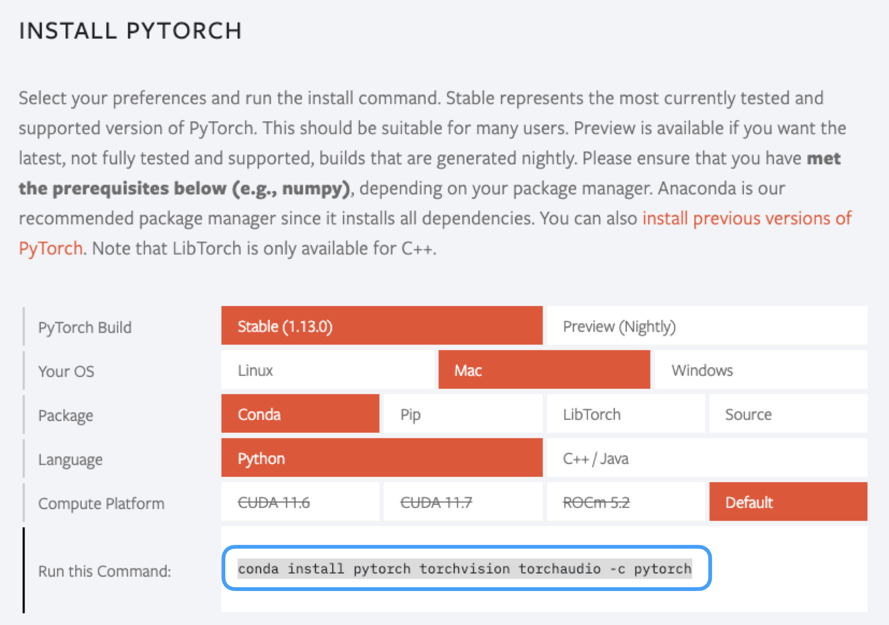

# Pytorch Summary

## 가상 환경 구성 
Anaconda를 설치 했다 가정 <br>

가상 환경은 각 프로젝트마다 파이썬 실행 환경을 독립적으로 활용할 수 있게 해주는 기능, 다른 파이썬 프로젝트를 위해 새로운 환경을 구성해야 한다면 간단하게 가상 환경을 생성하면 됨 <br>

- 가상환경 생성
```
$ conda create --name pytorch_test python=3
```

- 가상환경 실행
```
$ source activate pytorch_test
```

## CUDA 역할 및 설치 
CUDA는 GPU에서 병렬 처리를 수행하는 알고리즘으로 각종 프로그래밍 언어에 사용할 수 있도록 해주는 GPGPU(General-Purpose computing on Graphics Processing Units) 기술 <br>

https://developer.nvidia.com/cuda-toolkit-archive 사이트에 접속해 본인이 이용하고 있는 GPU와 Python 버전을 확인해 본인에게 맞는 버전을 설치 해야 함

## CuDNN 역할 및 설치
'nvidia CUDA Deep Neural Network Library'의 줄임말로 딥러닝 모델을 위한 GPU 가속화 라이브러리의 기초 요소와 같은 일반적 루틴을 빠르게 이행할 수 있도록 해주는 라이브러리 <br>

TensorFlow, Pytorch를 모두 지원하며 CUDA와 반드시 함께 설치해야 함 

## Pytorch 설치
https://pytorch.org/ 사이트로 접속해 os, package, language 등등을 나의 상황에 맞게 선택하면 실행해야 할 Command를 알려줌 <br>
