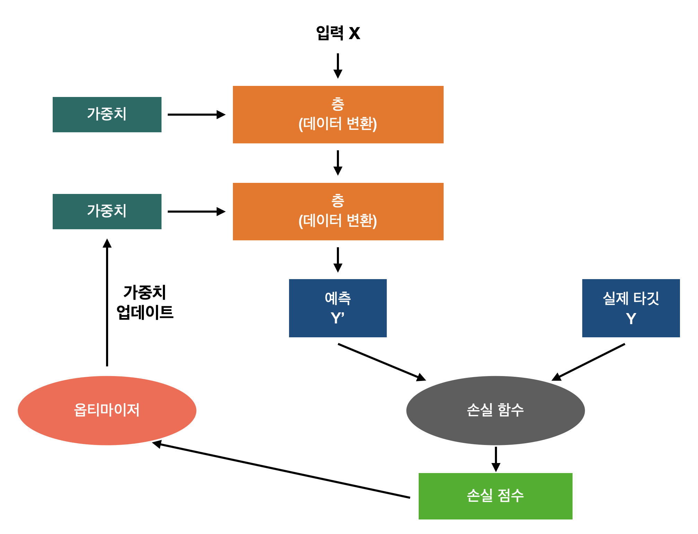

# DeepLearning 요약 
DeepLearning을 학습해오며 배웠던 것들을 정리하는 공간.

## Structure
- Theory : 이론 위주 학습 정리
- Pytorch : Pytorch를 이용해 신경망 구현
- Python : Python으로 신경망 구현
- TensorFlow : Keras Tensorflow로 신경망 구현

## Deep Learning 전체 프로세스

 

## Index
- 딥러닝 모델 학습 전 알아두어야 할 이론
  - [확률적 경사 하강법(SGD) 이란?](Theory/02_StochasticGradientDescent/)
  - [역전파법 이란?](Theory/03_Backpropagation/)
    - [역전파법 구현 - Python](Python/01_Backpropagation_Theory/)
  - [텐서, 손실함수, 옵티아미저란?](TensorFlow/0_dl_math/)
- 앞먹임 신경망
  - [앞먹임 신경망 이론(Feedforward Neural Network) 이란?](Theory/01_FeedforwardNeuralNetwork/)
  - [앞먹임 신경망 구현 - Keras](TensorFlow/1_BasicNeuralNet/)
  - [앞먹임 신경망 구현 - Pytorch](Pytorch/1_MLP/)
- 자기부호화기
  - [자기부호화기(AutoEncoder) 란?](Theory/04_AutoEncoder/)
  - [자기부호화기(AutoEncoder) 구현 - Pytorch](Pytorch/1_MLP/1_AutoEncoder.ipynb)
- 합성곱 신경망
  - [합성곱 신경망(CNN) 이란?](Theory/05_CNN/)
  - [CNN 구현 - Keras](TensorFlow/2_CNN/)
  - [CNN 구현 - Pytorch](Pytorch/2_CNN/)
- 재귀 신경망
  - [재귀 신경망(RNN) 이란?](Theory/06_RNN/)
  - [재귀 신경망 구현 - Keras](TensorFlow/3_RNN/)
  - [재귀 신경망 구현 - Pytorch](Pytorch/3_NLP/)