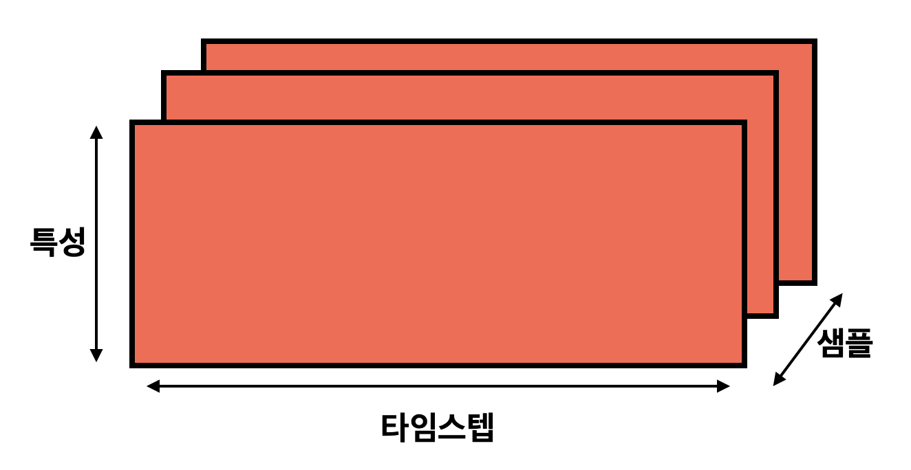
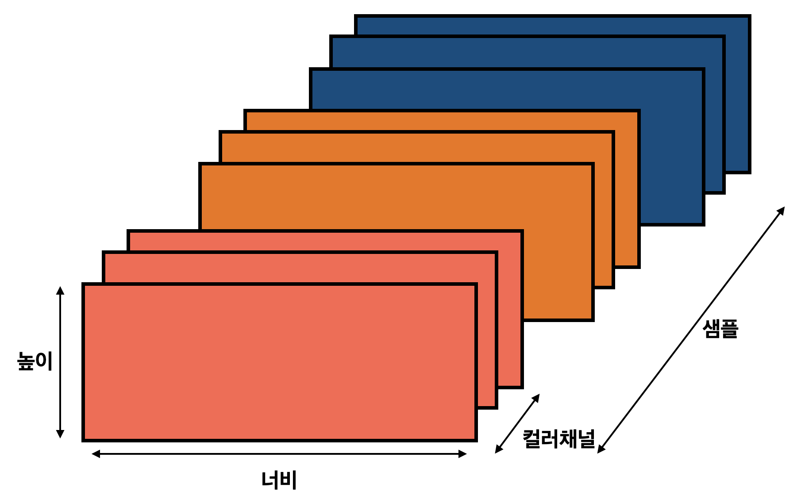

# 신경망을 위한 데이터 표현
- **텐서(tensor)** : 데이터를 저장하는 다차원 넘파이 배열, 모든 머신 러닝 시스템은 텐서를 기본 데이터 구조로 사용
    - 데이터를 위한 컨테이너(Container)
    - 임의의 차원 개수를 가지는 행렬의 일반화된 모습

## 스칼라(0D 텐서)
- 하나의 숫자만 담고 있는 텐서
- 스칼라 텐서, 0차원 텐서, 0D 텐서라고도 불림
- ndim 속성을 사용하면 넘파이 배열의 축 개수 확인이 가능
```
import numpy as np
x = np.array(12)
x.ndim
```

## 벡터(1D 텐서)
- 숫자의 배열을 벡터 또는 1D 텐서라 부름
- 1D 텐서는 하나의 축을 가짐
```
import numpy as np
x = np.array([12, 3, 6])
x.ndim
```
- 벡터와 텐서의 표현에 혼동을 조심
    - 5D 벡터: 하나의 축을 따라 5개의 차원을 가진 것
    - 5D 텐서: 5개의 축을 가진 것

## 행렬(2D 텐서)
- 벡터의 배열이 행렬(matrix) 또는 2D 텐서
```
import numpy as np
x = np.array([12, 3, 6],
            [2, 13, 9],
            [4, 1, 6])
x.ndim
```

## 3D 텐서와 고차원 텐서
```
import numpy as np
x = np.array([
            [[12, 3, 6],
            [2, 13, 9],
            [4, 1, 6]],
            [[2, 1, 3],
            [12, 23, 19],
            [4, 12, 8]]
            ])
x.ndim
```
- 딥러닝에서는 보통 0D에서 4D 까지의 텐서를 다룸

## 핵심 속성
- 축의 개수(랭크) : 예로 3D 텐서에는 3개의 축이 존재, 넘파이 라이브러리에 ndim 속성을 통해 확인 가능
- 크기(shape) : 텐서의 각 축을 따라 얼마나 많은 차원이 있는지를 나타낸 파이썬의 튜플
- 데이터 타입 : 텐서에 포함된 데이터의 타입
    - ex] float32, uint8, float64 ...
    - 드물게 char 타입을 사용하기도 함

## 넘파이로 텐서 조작
- 배열에 있는 특정 원소들을 선택하는 것을 **슬라이싱(slicing)** 이라 함

## 텐서의 실제 사례
- 벡터 데이터: (samples, features) 크기의 2D 텐서
- 시계열 데이터 또는 시퀀스(sequence) 데이터: (samples, timesteps, features) 크기의 3D 텐서
- 이미지 데이터: (samples, height, width, channels) 또는 (samples, channels, height, width) 크기의 4D 데이터
- 동영상 데이터: (samples, frames, height, width, channels) 또는 (samples, frames, channels, height, width) 크기의 5D 텐서

### 벡터 데이터
- 첫번째 축: 샘플 축
- 두번째 축: 특성 축(feature axis)
- ex] 나이, 번호, 소득으로 구성된 인구 통계 데이터의 경우 각 사람은 3개의 값을 가진 벡터로 구성되고 10만 명이 포함된 전체 데이터셋은 (100000, 3) 크기의 텐서에 저장

### 시계열 데이터 또는 시퀀스 데이터
- 데이터에서 시간(또는 연속된 순서)이 중요할 때는 시간 축을 포함한 3D 텐서로 저장
- 관례적으로 시간 축은 항상 두 번째 축
- ex] 1분마다 '현재 주식 가격', '1분 동안 최고 가격', '1분 동안 최소 가격'을 저장. 1분마다 데이터는 3D벡터로 인코딩되고 하루 동안의 거래는 (390, 3) 크기의 2D 텐서로 인코딩(하루 거래 시간 390분), 250일치의 데이터는 (250, 390, 3) 크기의 3D 텐서로 저장


<br>

### 이미지 데이터
- 이미지는 '높이', '너비', '컬러 채널'의 3차원으로 이뤄짐
- 흑백 이미지의 경우 채널 차원의 크기는 1로 256x256 크기의 흑백 이미지 128개는 (128, 256, 256, 1) 크기의 텐서에 저장


<br>

## 신경망의 구조
- 신경망 훈련의 요소
    - **네트워크(또는 모델)** 을 구성하는 **층**
    - **입력 데이터** 와 그에 상응하는 **타깃**
    - 학습에 사용할 피드백 신호를 정의하는 **손실 함수**
    - 학습 진행 방식을 결정하는 **옵티마이저**

- Layer Ex]
    - 차원이 784인 2D 텐서를 입력으로 받는 층 (배치 차원인 0번째 축은 지정하지 않기 때문에 어떤 배치 크기도 입력으로 받을 수 있음)
```
from keras import layers

layer = layers.Dense(32, input_shape=(784,))
```
<br>

- Keras에서는 모델에 추가된 층을 자동으로 상위 층의 크기와 맞추어 주기 때문에 호환성을 걱정하지 않아도 됨
    - Ex] 두번째 층에는 input_shape 매개변수 지정하지 않음, 앞선 층의 출력 크기를 입력 크기로 자동으로 채택되기 때문
```
from keras import models
from keras import layers

model = models.Sequential()
model.add(layers.Dense(32, input_shape=(784,)))
model.add(layers.Dense(10))
```

## 손실 함수와 옵티마이저
- **손실 함수(loss function) 목적 함수(objective function)** : 훈련하는 동안 최소화될 값, 주어진 문제에 대한 성공 지표
- **옵티마이저(optimizer)** : 손실 함수를 기반으로 네트워크가 어떻게 업데이트 될지 결정, 특정 종류의 확률적 경사 하강법(SGD)를 구현 

- 여러 개의 출력을 내는 신경망은 여러 개의 손실 함수를 가짐(출력당 하나씩)
    - But 경사 하강법 과정은 하나의 스칼라 손실 값을 기준으로 함
    - 손실이 여러 개인 네트워크에서는 모든 손실이 평균을 내서 하나의 스칼라 양으로 합쳐짐

