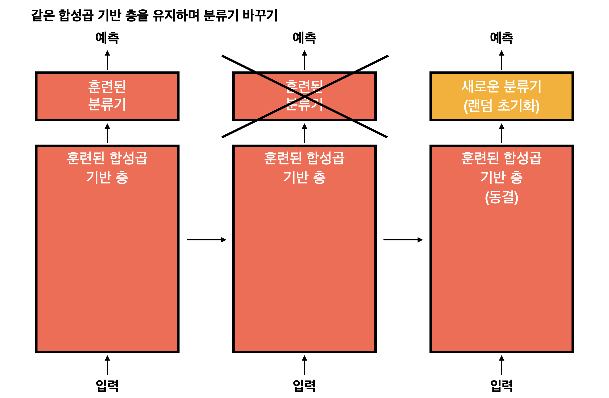

# Computer Vision

## 사전 훈련된 컨브넷 사용
- 사전 훈련된 네트워크를 사용하는 두가지 방법
    1. **특성 추출(feature extraction)**
    2. **미세 조정(fine tuning)** 

### 특성 추출
- 사전에 학습된 네트워크의 표현을 사용하여 새로운 샘플에서 흥미로운 특성을 뽑아 내는것
- 이런 특성을 사용하여 새로운 분류기를 처음부터 훈련
- 특성 추출은 사전에 훈련된 네트워크의 합성곱 기반 층을 선택하여 새로운 데이터를 통과시키고 그 출력으로 새로운 분류기를 훈련

 

- [CODE] : 2_CNN_FeatureExtraction.ipynb

### 미세 조정
특성 추출에 사용했던 동결 모델의 상위 층 몇 개를 동결에서 해제하고 모델에 새로 추가한 층과 함께 훈련하는 것

- 네트워크를 미세 조정하는 단계
    - 사전에 훈련된 기반 네트워크 위에 새로운 네트워크를 추가
    - 기반 네트워크를 동결
    - 새로 추가한 네트워크를 훈련
    - 기반 네트워크에서 일부 층의 동결을 해제
    - 동결을 해제한 층과 새로 추가한 층을 함께 훈련

- [CODE] : 3_CNN_FineTuning.ipynb

## ConvNet 학습 시각화
컨브넷의 표현은 시각적 개념을 학습, 시각적인 개념을 학습하는것이기 때문에 시각화가 좋음
- **컨브넷 중간층의 출력(중간층에 있는 활성화)을 시각화**
    - 연속된 컨브넷 층이 입력을 어떻게 변형시키는지 이해하고 개별적 컨브넷 필터의 의미를 파악
- **컨브넷 필터를 시각화**
    - 컨브넷의 필터가 찾으려는 시각적 패턴과 개념이 무엇인지 이해하는데 도움
- **클래스 활성화에 대한 히트맵(heapmap)을 이미지에 시각화**
    - 이미지의 어느 부분이 주어진 클래스에 속하는 데 기여했는지 이해하고 이미지에서 객체 위치를 추정

### 중간층의 활성화 시각화
