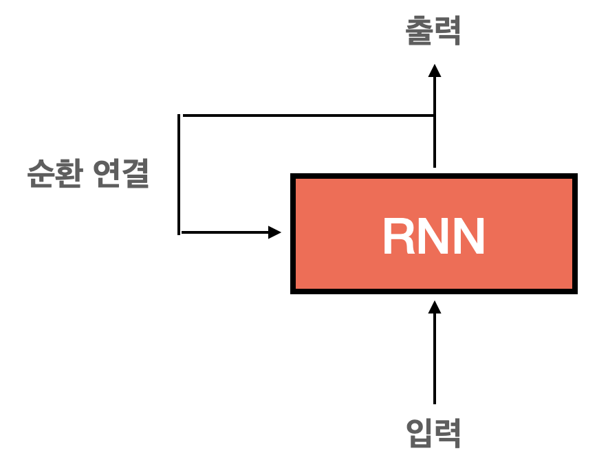
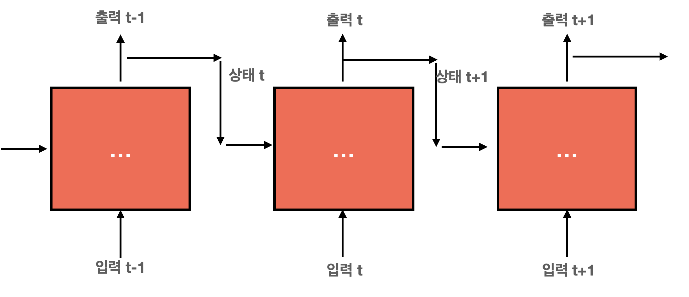
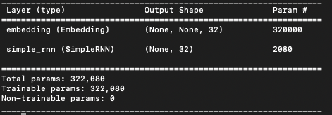
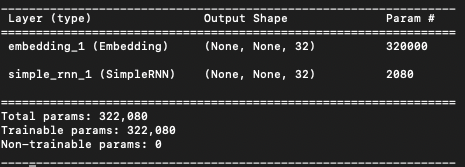
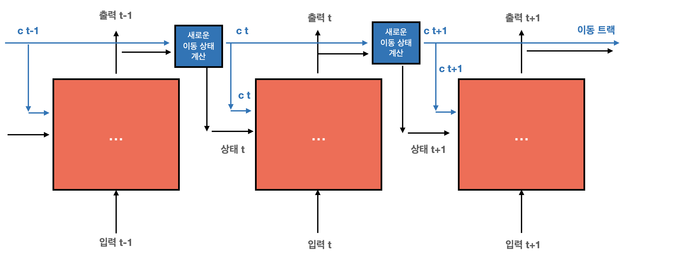

# Text와 Sequence 처리 DeepLearning
- 시퀀스 데이터를 처리하는 기본적 딥러닝 모델은 **순환 신경망(recurrent neural network)** 과 **1D 컨브넷(1D Convnet)** 두 가지
- 텍스트를 수치형 텐서로 변환하는 과정을 **텍스트 벡터화(vectorizing text)** 라 함
    - 텍스트를 단어로 나누고 각 단어를 하나의 벡터로 변환
    - 텍스트를 문자로 나누고 각 문자를 하나의 벡터로 변환
    - 텍스트에서 단어나 문자의 n-그램을 추출하여 각 n-그램을 하나의 벡터로 변환

- 텍스트를 나누는 단위를 **토큰(token)** 이라 함
- 텍스트를 토큰으로 나누는 작업을 **토큰화(tokenization)** 이라 함

- 토큰을 벡터로 연결하는 방법
    1. 원-핫 인코딩(one-hot encoding)
    2. 토큰 임베딩(token embedding)
        - 일반적으로 단어에 대해서만 사용되어 **단어 임베딩(word embedding)**이라고도 함

## 단어와 문자의 원-핫 인코딩
- 원-핫 인코딩은 토큰을 벡터로 변환하는 가장 일반적이고 기본적 방법
- 모든 단어에 고유한 정수 인덱스를 부여하고 이 정수 인덱스 i를 크기가 N(어휘 사전의 크기)인 이진 벡터로 변환
    - 이 벡터는 i번째 원소만 1이고 나머지는 0

<br>

## Code
- [CODE] one_hot_encoding_word.py : 단어 수준의 원-핫 인코딩
- [CODE] one_hot_encoding_character.py : 문자 수준의 원-핫 인코딩
- [CODE] one_hot_encoding_keeras.py : 케라스를 사용한 단어 수준의 원-핫 인코딩 

## 단어 임베딩
- 원-핫 인코딩으로 만든 벡터는 희소(sparse)하고 대부분 0으로 채워지는 고차원 벡터
- 단어 임베딩은 실수형 벡터
- 단어 임베딩은 원-핫 벡터에 비해 저차원이고 희소하지 않고 밀집되어 있음
- 단어 임베딩 만드는 방법
    1. 관심 대상인 문제와 함께 단어 임베딩(ex]문서 분류, 감성 예측)
    2. 다른 머신 러닝 작업에서 미리 계산된 단어 임베딩을 로드
        - 사전 훈련된 단어 임베딩(pretrained word embedding)

### Embedding 층을 사용해 단어 임베딩 학습
- 단어와 밀집 벡터를 연관 짓는 가장 간단한 방법은 랜덤하게 벡터를 선택하는 것
- But, 문제점이 비슷한 단어끼리 완전히 다른 임베딩을 가지게 됨, 심층 신경망이 이런 임의의 구조적이지 않은 임베딩 공간을 이해하기 어려움
- 단어 벡터 사이에 좀 더 추상적이고 기하학적 관계를 얻으려면 단어 사이에 있는 의미 관계를 파악해야 함
- 단어 임베딩은 언어를 기하학적 공간에 매핑하는 것
    - 잘 구축된 임베딩 공간에서는 동의어가 비슷한 단어 벡터로 임베딩될 것
    - 두 단어 벡터 사이의 거리는 의미 거리와 관계되어짐
        - 멀리 떨어진 위치에 임베딩된 단어 의미는 서로 다른 반면 비슷한 단어들은 가까이 임베딩
- 좋은 단어 임베딩 공간을 만드는 것은 문제에 따라 크게 달라짐
    - 특정 의미 관계의 중요성이 작업에 따라 다르기 때문
    - 새로운 작업에는 새로운 임베딩을 학습하는 것이 타당
        - **Embedding 층의 가중치를 학습**하면 됨
    
```
from keras.layers import Embedding

# Embedding 층은 적어도 2개의 매개변수를 받음
# 가능한 토큰의 개수(여기서는 1,000)와 임베딩 차원(여기서는 64)
embedding_layer = Embedding(1000, 64)
```

- Embedding 층을 특정 단어를 나타내는 정수 인덱스를 밀집 벡터로 매핑하는 딕셔너리로 이해


<br>

- Embedding 층은 크기가 (samples, sequence_length)인 정수 2D 텐서를 입력으로 받음
    - ex] (32, 10) 크기의 배치 : 길이가 10인 시퀀스 32개로 이루어진 배치 <br>
    (64, 15) : 길이가 15인 시퀀스 64개로 이루어진 배치
    - 배치에 있는 모든 시퀀스는 길이가 갇아야 하므로 작은 길이의 시퀀스는 0으로 패딩되고 길이가 더 긴 시퀀스는 잘림
- Embedding 층은 크기가 (samples, sequence_length, embedding_dimensionality)인 3D 실수형 텐서를 반환
    - 이런 3D 텐서는 RNN 층이나 1D 합성곱 층에서 처리
- Embedding 층의 객체를 생성할 때 가중치는 다른 층과 마찬가지로 랜덤하게 초기화 됨
- 훈련하면서 이 단어 벡터는 역전파를 통해 점차 조정되어 이어지는 모델이 사용할 수 있도록 임베딩 공간을 구성하게 됨
- 훈련이 끝나면 임베딩 공간은 특정 문제에 특화된 구조를 많이 가지게 됨

```
from keras.models import Sequential
from keras.layers import Flatten, Dense, Embedding

model = Sequential()
model.add(Embedding(10000, 8, input_length=maxlen))

model.add(Flatten())

model.add(Dense(1, activation='sigmoid'))
model.compile(optimizer='rmsprop', loss='binary_crossentropy', metrics=['acc])
model.summary()

history = model.fit(x_train, y_train, epochs=10, batch_size=32, validation_split=0.2)
```

### 사전 훈련된 단어 임베딩 사용
- 훈련데이터가 부족하면 작업에 맞는 단어 임베딩을 학습할 수 없음
- Word2vec 과 GloVe가 사전 학습에 많이 쓰이는 모델들

### Code
- [CODE] : jupyternotebook/IMDB_WordEmbedding.ipynb

## 순환 신경망(RNN)
- 완전 연결 네트워크나 컨브넷처럼 지금까지의 모든 신경망의 특징은 메모리가 없다는 것
- 이런 네트워크로 시퀀스나 시계열 데이터를 처리하려면 네트워크에 전체 시퀀스를 주입해야만 함
- 순환 신경망은 시퀀스의 원소를 순회하면서 지금까지 처리한 정보를 상태(state)에 저장
    - RNN은 내부에 루프를 가진 신경망의 한 종류
- 네트워크에 하나의 입력을 주입한다 했을때 데이터 포인트가 한 번에 처리되지 않고 시퀀스의 원소를 차례대로 처리


<br>


<br>

### 케라스의 순환 층
케라스의 SimpleRNN을 사용

```
from keras.layers import SimpleRNN
```

- SimpleRNN은 (batch_size, timesteps, input_features) 크기의 입력을 받음
- SimpleRNN은 두가지 모드로 실행
    1. 각 타임스텝의 출력을 모은 전체 시퀀스를 반환 : (batch_size, timesteps, output_features)인 3D 텐서
    2. 입력 시퀀스에 대한 마지막 출력만 반환 : (batch_size, output_features)인 2D 텐서
- 이 모드는 객체를 생성할 때 return_sequences 매개변수로 선택할 수 있음
```
from keras.models import Sequential
from keras.layers import Embedding, SimpleRNN

model = Sequential()
model.add(Embedding(10000, 32))
model.add(SimpleRNN(32))
model.summary()
```


<br>

```
model = Sequential()
model.add(Embedding(10000, 32))
model.add(SimpleRNN(32, return_sequences=True))
model.summary()
```


<br>

### Code
- [CODE] : jupyternotebook/1_SimpleRNN.ipynb


## LSTM & GRU
- SimpleRNN은 실전에서 사용하기엔 너무 단순
- SimpleRNN은 이론적으론 시간 t에서 이전의 모든 타임스텝의 정보를 유지할 수 있음 
- but, 실제로는 긴 시간에 걸친 의존성은 학습할 수가 없음
    - 그래디언트 소실 문제(vanishing gradient problem)이 발생하기 때문
- LSTM(Long Short-Term Memory)은 SimpleRNN의 한 변종으로 정보를 여러 타임스텝에 걸쳐 나르는 방법이 추가됨 


<br>

- LSTM 셀이 과거 정보를 나중에 다시 주입하여 그래디언트 소실 문제를 해결함 

```
from keras.layers import LSTM

model = Sequential()
model.add(Embedding(max_features, 32))
model.add(KSTM(32))
model.add(Dense(1, activation='sigmoid))

```