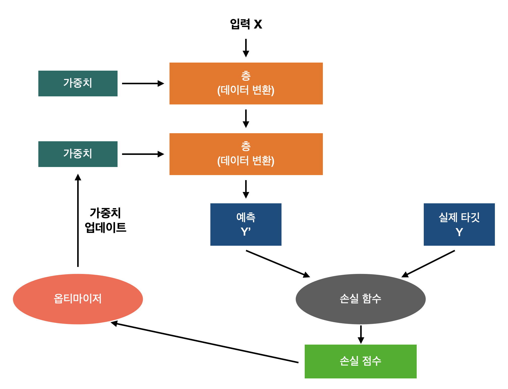
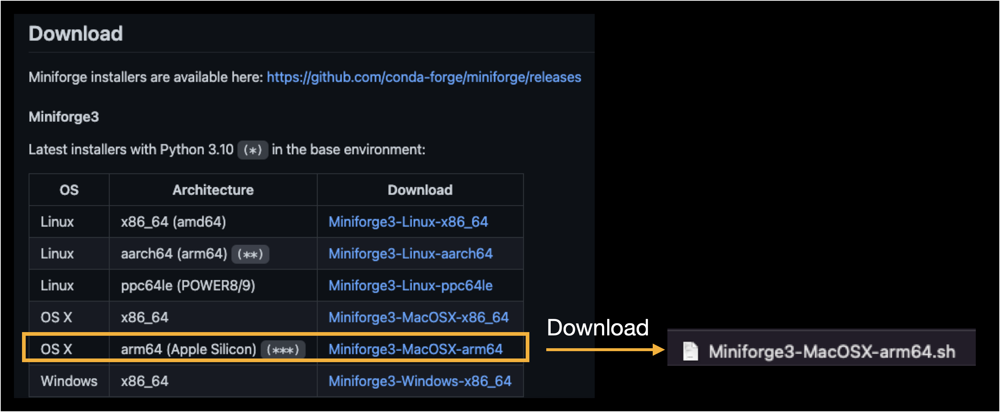

# Keras TensorFlow
## Deep Learning 전체 프로세스


## M1 Mac에 Tensorflow 설치방법
1. miniforge 설치
    - Download [miniforge link](https://github.com/conda-forge/miniforge)
    - $ sh ~/Downloads/Miniforge3-MacOSX-arm64.sh
    - $ source ~/miniforge3/bin/activate


<br>


2. 파이썬 가상환경 생성
    - $ conda create -n 환경명 python=3.9
    - $ conda activate 환경명

3. Tensorflow 의존 패키지 설정
    - $ conda install -c apple tensorflow-deps

4. Tensorflow 패키지 설치
    - $ python -m pip install tensorflow-macos

5. Tensorflow-metal(GPU 프레임워크) 패키지 설치
    - $ python -m pip install tensorflow-metal

6. 파이썬 쉘에서 설치된 Tensorflow 버전 확인
```
>>> import tensorflow
>>> tensorflow.__version__
```