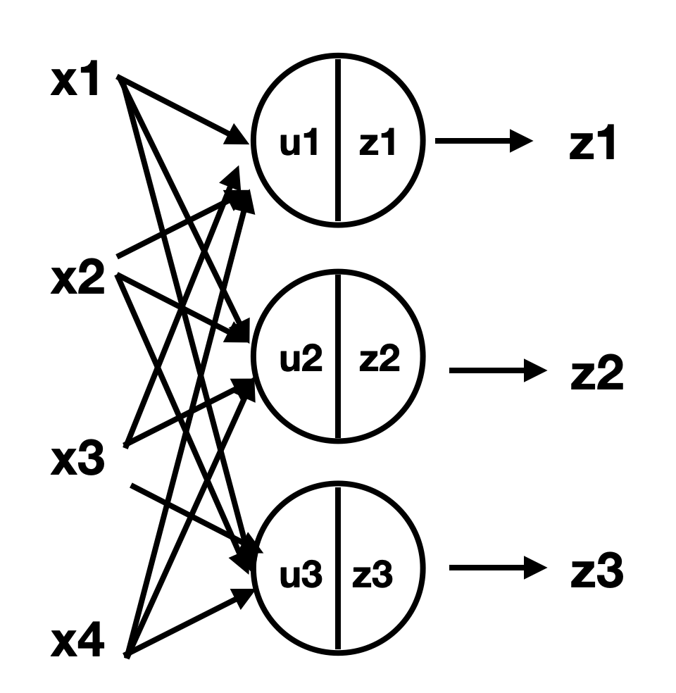

# Feedforward Neural Network(앞먹임 신경망)
층 모양으로 늘어선 유닛이 인접한 층(layer)들과만 결합하는 구조, 정보가 입력 측으로부터 출력 측으로 한 방향으로만 흐르는 신경망. **다층 퍼셉트론(multi-layer perceptron)** 이라 불리기도 함  

 
z는 각 입력(x1, x2, ..)마다 **가중치(weight)** 를 곱한 값을 모두 합하고 **bias** 를 더한 후 그 값을 **활성화 함수(activation function)** 라 불리는 함수의 입력으로 넣은 후 출력값 
  
앞먹임 신경망은 층과 층 사이에만 결합을 가짐. 왼쪽 층의 유닛의 출력이 오른쪽 층의 유닛의 입력이 되는 형태로 왼쪽에서부터 오른쪽으로만 한 방향으로 정보가 전달됨 

 

## 활성화 함수
### 시그모이드 함수(sigmoid function)
활성화 함수는 일반적으로 단조증가(monotone increasing)하는 비선형 함수가 사용. 가장 많이 사용하는 활성화 함수로는 **로지스틱 시그모이드 함수(Logistic sigmoid function)** 또는 **로지스틱 함수(logistic function)** 이 있음

로지스틱 함수는 실수 전체를 정의역으로 가지며 (0, 1)을 치역으로 가짐

로지스틱 함수 대신 유사한 쌍곡선 정접함수를 사용하는 경우도 존재, 함수의 치역은 (-1, 1)로 달라지지만 로지스틱 함수와 비슷한 성질을 갖고 있음. 두 함수 모두 입력의 절대값이 포화하여 일정값을 가지며, 그 사이의 값에 대해서는 출력이 서서히 매끄럽게 변화하는 특징을 가짐. 이러한 형태를 일반적으로 
**시그모이드 함수(sigmoid function)** 으로 묶어 부름

### 램프 함수(ramp function, rectified linear function)
최근에는 활성화 함수 대신 램프 함수도 자주 사용.  
램프 함수는 z = u인 선형함수 중 u < 0인 부분을 f(u) = 0으로 바꾼 단순 함수  

단순하고 계산량이 적으며, 활성화 함수를 사용하는 것 보다 학습이 빠르고 최종 결과가 더 좋은 경우가 많음.  
시그모이드 함수 사용시엔 입력값의 변동 폭에 주의해야 함(너무 커질 경우 출력 대부분이 0이나 1 둘 중 하나가 됨) 그러나 램프 함수를 사용시엔 그런 일이 일어나지 않음.  
이 함수를 갖는 유닛을 **ReLU(Rectified Linear Unit)** 이라고 표기

### 선형사상(Linear Mapping), 항등사상(Identity Mapping)
신경망에서 각 유닛의 활성화 함수가 비선형성을 갖는 것이 중요하지만 선형사상을 사용하는 경우 또한 존재(회귀 문제(regression problem)를 위한 신경망에선 출력층에 항등사상을 사용)

### 소프트맥스 함수(Softmax Function)
클래스 분류를 목적으로 사용 

### 맥스 아웃(maxout)

 

## 다층 신경망
여러 개층으로 이뤄진 신경망의 경우 각 층을 l = 1,2,3으로 표기, l = 1인 층을 **입력층(input layer)**, l = 2는 **중간층(internal layer) 또는 은닉층(hidden layer)**, l = 3인 층을 **출력층(output layer)** 라 부름.

## 출력층의 설계와 오차함수
앞먹임 신경망이 표현하는 함수는 신경망의 가중치를 바꾸며 변화함. w(가중치)를 잘 선택하여 신경망이 원하는 함수를 얻게됨.  
데이터가 하나의 입력 x에 대해 결과 d를 가진다고 할 때, 이 입출력 쌍(x, d) 하나하나를 훈련 샘플(training samples)라 부르고 그 집한을 훈련 데이터(training data)라 부름   
모든 입출력 쌍 (xn, dn)(n = 1, ..., N) 입력 xn이 주어진 신경망의 출력 y(xn; w)이 최대한 dn과 가까워지도록 w(가중치)를 조절하는 것을 학습이라 함. 이 때 신경망이 나타내는 함수와 훈련 데이터와의 가까운 정도(y(xn; w) ~= dn)의 거리를 측정하는 척도를 **오차함수(error function)** 이라 함.  

 

## 회귀(Regression)
출력이 연속값을 갖는 함수를 대상으로 훈련 데이터를 잘 재현하는 함수를 찾는 것.  
목적으로하는 함수와 같은 치역을 갖는 함수를 출력층의 활성화 함수로 골라야 함(목표함수의 치역이 -1~1인 경우 출력층의 활성화 함수는 쌍곡선 정접함수가 적당하며 임의의 실수를 갖는 경우엔 항등 사상이 적합)

 

## 이진분류
입력 데이터를 내용에 따라 두 종류로 구별.

 

## 다클래스분류
입력 데이터를 내용에 따라 유한개의 클래스로 구별.