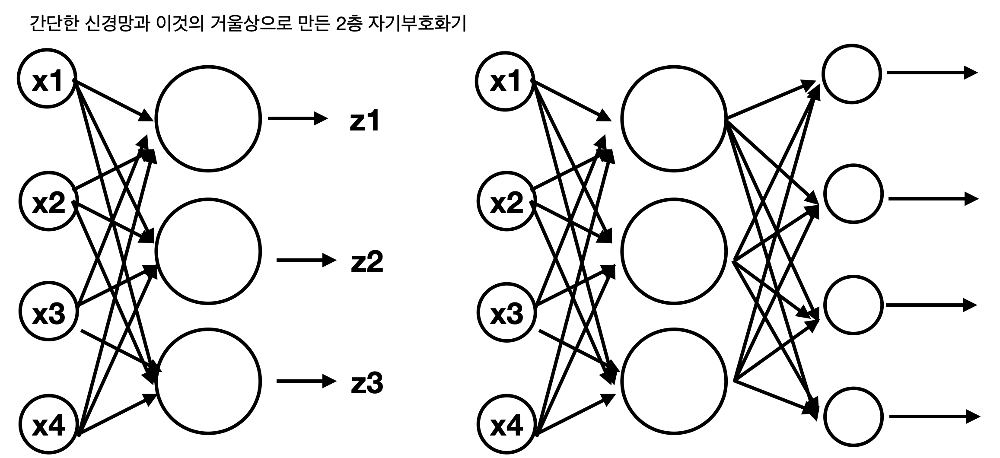
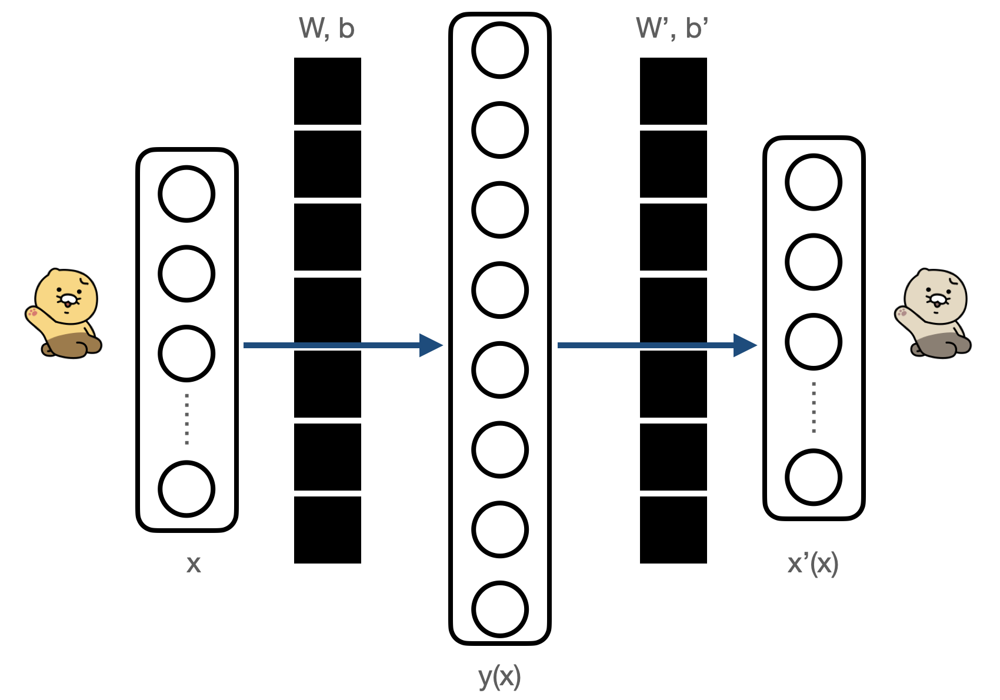
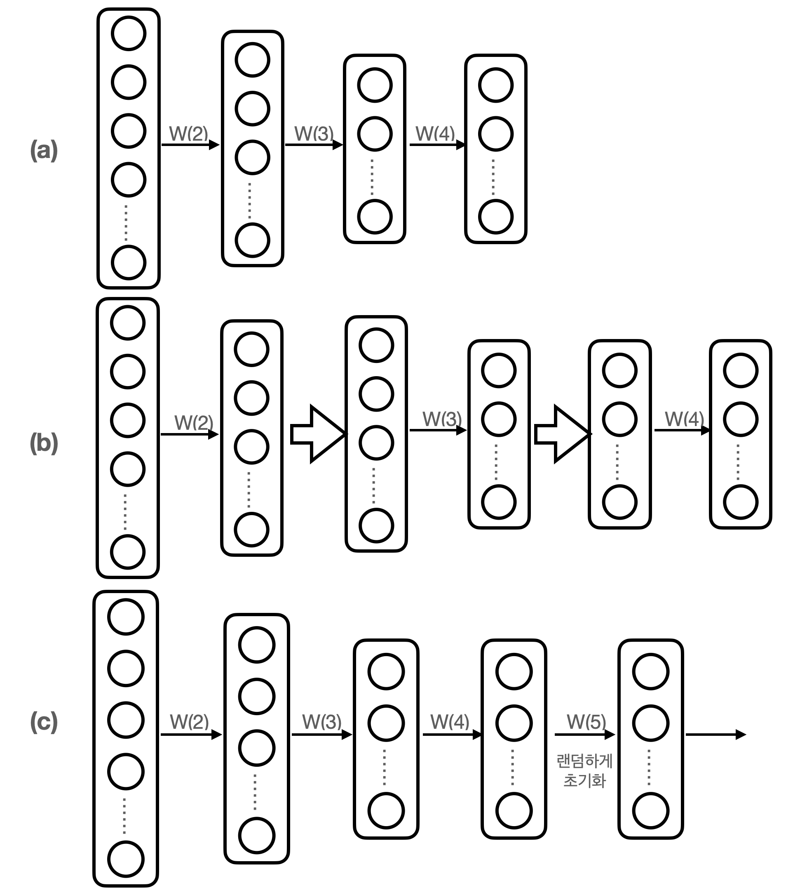
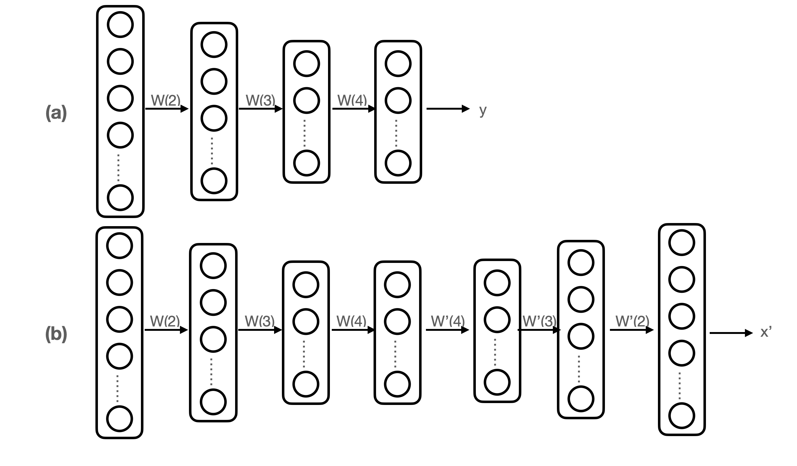

# AutoEncoder(자기부호화기)
목표 출력 없이 입력만으로 구성된 훈련 데이터로 비지도 학습을 수행하여 데이터의 특징을 잘 나타내는 더 나은 표현을 얻는 것이 목표인 신경망  

딥 네트워크의 사전훈련, 즉, 가중치의 좋은 초깃값을 얻는 목적으로도 이용  

## 개요
신경망의 출력층에 출력층에서 본 거울상을 반복시켜 입력층 그리고 출력층과 같은 수의 유닛을 갖는 신경망을 만듬  

 

새로 추가한 층의 활성화 함수로, 일반적으로 가장 첫 층의 활성화 함수 f와 다른 것을 사용해도 무방  

신경망을 이렇게 만들어 입력 x에 대하여 출력 x가 원래의 입력 x와 최대한 가까워지도록 설정 

입력 x를 주었을 때의 중간층의 출력을 y라 할 때 x에 의해 결정되는 y를 x의 **부호(code)**라 하고 첫 번째 변환 y=f(Wx+b)를 **부호화(encode)** 두번째 변환(거울상) x'=f'(W'x+b')을 **복호화(decode)**라 부름  

학습의 목표는 입력을 부호화한 뒤 이어 다시 복호화했을 때 원래의 입력을 되도록 충실히 재현할 수 있는 부호화 방법을 찾는 것 --> 이러한 동작을 하는 신경망을 **자기부호화기(autoencoder)** 라 부름  

## 자기부호화기의 설계
### 출력층의 활성화 함수와 오차함수
자기부호화기의 활성화 함수로는 중간층의 f와 출력층의 f'이 존재  

중간층의 f는 자유롭게 바꿀 수 있으며 통상 비선형 함수를 사용. 출력층의 f'은 신경망의 목표출력이 입력한 x 자신이 될 수 있도록 입력 데이터의 유형에 따라 선택  

오차함수로는 교차 엔트로피를 사용  

## 자기부호화기의 동작
자기 부호화기는 오차함수를 최소화하는 과정을 통해 신경망의 가중치와 바이어스를 결정. 보통 중간층의 (W, b)와 출력층의 (W', b') 중 유용한 것은 전자뿐(출력층의 W', b'는 사용하지 않음) 이들 파라미터는 데이터를 나타내는 **자질(feature)** 라 불림  

자기부호화기의 목적은 이러한 자질의 학습을 통해 샘플 x의 또다른 표현인 y를 얻는 것(종종 y를 사용하면 성능이 상승하는 경우가 존재)  

 

## 희소 규제화
### 데이터의 과완비한 표현
일반적으로 좋은 자질은 입력 데이터에서 불필요한 정보를 제거하고 그 본질만을 추출하는 것 그렇다면 입력 데이터의 성분 수 보다도 그것을 부호화한(인코딩된) 부호가 갖는 성분 수는 자연히 더 작을 것 

But, 반드시 항상 그런것은 아님. 희소 규제화를 이용하면 여분의 자유도를 갖는 특징이어도 입력 데이터를 잘 나타내는 자질을 얻는것이 가능 --> 이를 **과완비(overcomplete)** 라 함  

희소 규제화를 사용하면 중간층의 유닛 수가 더 많은 경우에도 자기부호화기가 의미 있는 표현을 학습할수 있게 되는데 이를 **희소자기부호화기(sparse autoencoder)** 라 부름  

개개의 훈련 샘플 x를 되도록 적은 수의 중간층 유닛을 사용하여 재현할 수 있도록 파라미터를 결정, y의 각 유닛 중 되도록 적은수의 유닛만이 0이 아닌 출력치를 갖고 나머지는 출력이 0이 되도록하는 제약을 함  

## 데이터의 백색화
훈련 데이터를 과제를 해결하는 데 불필요한 경향을 가지는데 이는 학습을 방해하는 원인이 됨. ---> 학습 전에 데이터를 처리하여 그런 데이터 내 경향을 제거하는 것이 중요. 이런 방법중 하나가 **백색화(whitening)**  

백색화의 목적은 훈련 샘플에서 성분 간의 상관성을 제거. 입력 데이터 x의 임의의 두 성분 x1과 x2가 서로 상관이 없도록 함. 정규화가 샘플의 성분 단위 처리였던 데에 비해, 백색화는 성분간의 관계를 수정하는 처리  

훈련 샘플의 각 성분간의 관계는 [공분산행렬](#공분산)로 구할 수 있음

## 딥 뉴럴넷의 사전훈련
여러 층으로 구성된 앞먹임 신경망은 기울기 소실 문제로 인해 일반적으로 학습이 잘 되지 않음. --> 이를 해결하기 위한 방법중 하나가 **사전훈련**  

앞먹임 신경망의 지도 학습법에서 일반적으로 학습을 시작할때 초기 가중치를 랜덤값으로 초기화, 사전훈련법의 기본 아이디어는 이 초깃값을 좀 더 좋은 값으로 정하면 학습이 좀 더 잘 될 것 이라는 것  

 
- (a): 목적으로 하는 다층 신경망
- (b): 각 층을 분해해서 자기부호화기로 재구성하고 가중치 W와 바이어스를 학습
- (c): (b)에서 얻은 각 층의 파라미터를 목표로 하는 신경망의 초깃값으로 하고 최상층에 가중치를 랜덤하게 초기화한 층을 추가하여 지도 학습을 실시

이렇게 자기부호화기를 층층이 쌓은 것을 **적층 자기부호화기(stacked autoencoder)** 라 함  

이렇게 사전훈련으로 얻은 파라미터를 초깃값으로 사용하면 신경망의 가중치를 랜덤값으로 초기화했을 때와 비교하여 기울기 소실 문제가 발생할 가능성이 훨씬 적고 학습이 좀 더 잘 진행되는 것으로 알려져 있음

## 그 외의 자기부호화기
### 심층 자기부호화기
여러 층의 앞먹임 신경망의 출력층을 이전 층으로 되접어 더 많은 층으로 구성된 자기부호화기 이를 **심층 자기부호화기(deep autoencoder)** 라 함

 
- (a): 심층 앞먹임 신경망
- (b): (a)로부터 만든 심층 자기부호화기

### 디노이징 자기부호화기
자기부호화기를 확장한 것으로 학습 시에 확률적인 요소를 도입하여 결과적으로는 제약볼츠만머신(RBM)에 맞먹는 성능을 가지도록 할 수 있음

## Reference
#### 공분산
2개의 확률변수의 상관정도를 나타내는 값  
2개의 변수중 하나가 상승시 다른 하나도 상승하면 공분산은 양의값, 하강시 다른 하나도 하강하면 음의 값을 나타낸다.  
