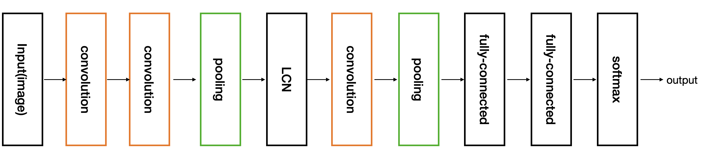
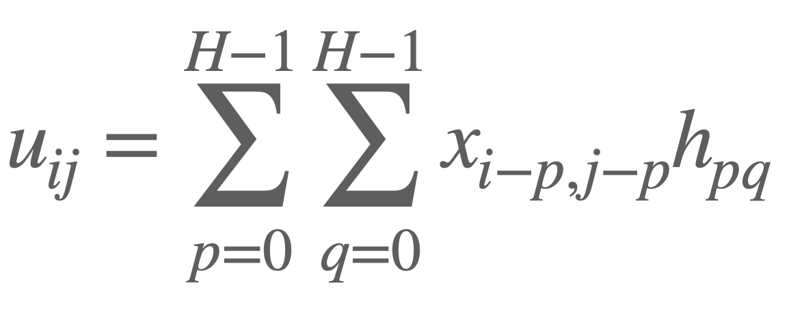
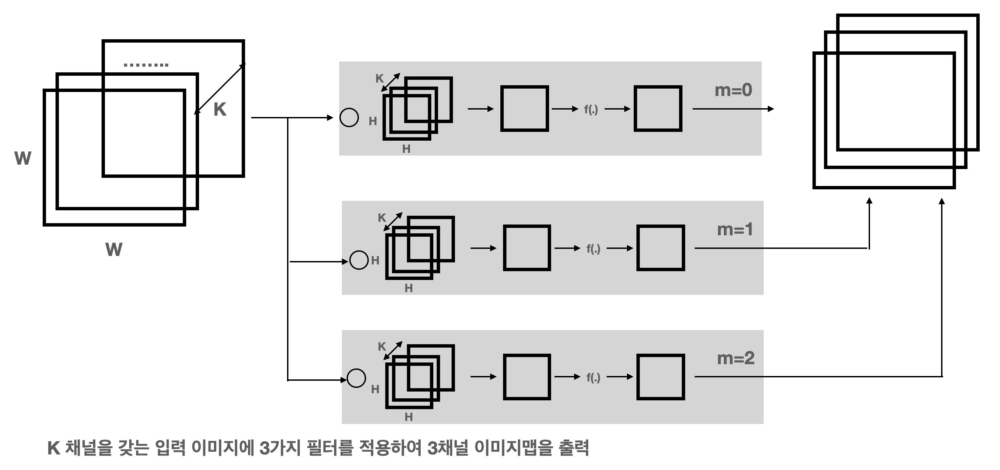

# CNN
합성곱 신경망의 특징은 **국소 감수 영역(local receptive field)** 및 **가중치 공유** 라 불리는 특별한 층간 결합을 가짐

## 단순 세포와 복잡 세포
- 합성곱 신경망은 인접한 층과 층 사이에 특정한 유닛만이 결합을 갖는 특별한 층 
- 층 에서는 합성곱과 폴링이라는 이미지 처리의 기본 연산이 일어남

## 전체적인 구조
- 입력 쪽에서 출력 쪽을 향해 **합성곱층** 과 **폴링층** 이, 합성곱층이 먼저 나오고 뒤이어 폴링층이 나오는 형태로 쌍을 이루며 이 쌍이 다시 여러 번 반복됨
- 합성곱층만으로 여러 층이 반복된 후, 그 뒤에 폴링층이 한층 붙는 경우 존재
- 합성곱층과 폴링층 뒤에 **국소 콘트라스트 정규화(Local Contrast Normalization, LCN)** 층을 배치
- 합성곱층과 폴링층이 반복되는 구조 뒤에는 인접한 층 사이의 유닛이 전결합한 층이 배치

 

## 합성곱
- 그레이 스케일 이미지를 예로 이미지 사이즈를 (W x W), 픽셀 인덱스를 (i, j)로 나타낸다 했을 때 픽셀 값을 x(i,j) 
- 필터(filter)라는 작은 크기의 이미지를 상정하고 크기를 (H x H), 필터의 픽셀은 인덱스 (p, q)로 나타내고 픽셀 값은 h(p,q)
- 이미지의 합성곱이란 이미지와 필터 사이 아래와 같은 연산

 

### 합성곱의 작용
이미지의 합성곱(또는 상관)은 필터의 명암 패턴과 유사한 명암 패턴이 입력된 이미지 어디에 있는지를 검출하는 작용을 함

### 패딩
- 합성곱은 이미지에 필터를 겹쳤을 때 이미지와 필터가 겹쳐지는 픽셀끼리 곱을 구하여 필터 전체에 그 값을 합하는 연산
  - 이미지로부터 필터가 벗어나는 위치에 적용하는 것은 불가능
- 합성곱 계산의 결과 이미지 크기는 입력 이미지의 크기보다 작아지게 됨
  - (W - 2[H/2]) x (W - 2[H/2])
    - [.] : 소수점은 버림
    - ex] 8x8 입력이미지, 3x3 필터 : 8-2[3/2] = 6
- 합성곱한 결과 이미지가 입력 이미지와 크기가 같으면 좋음
  - 입력 이미지의 바깥쪽 테두리를 만들어 크기를 늘려서 출력 이미지의 크기가 원래 입력 이미지와 같은 크기가 되도록 함
  - 이 태두리 부분은 픽셀값을 0으로 설정하는 방법으로 제로 패딩(zero-padding)이라 부르는 방법을 사용
  - CNN에서 제로 패딩이 널리 쓰이나 이미지 처리라는 관점에서 보면 좋지 않음
    - 제로 패딩 처리로 인해 출력 이미지의 주변부가 어둡게 되기 때문
    - 테두리 부분의 픽셀값을 0이 아닌 더 그럴듯한 값으로 채우는 기법이 존재

### 스트라이드
- 필터가 적용되는 위치를 1픽셀이 아닌 여러 픽셀씩 움직이며 계산할 수도 있음
- 이 필터의 적용 위치 간격을 **스트라이드(stride)** 라 함
- 출력 이미지의 크기
  - ([(W-1/s)] + 1) x ([(W-1/s)] + 1)
- 크기가 큰 입력 이미지를 다룰 때 합성곱층의 출력쪽 유닛 수가 너무 많아지는 것을 막기 위해 2 이상의 스트라이드 값을 적용하는 경우가 존재
  - But, 스트라이드 값을 크게 잡는 것은 이미지의 특징을 놓칠 가능성을 의미 일반적으로 성능이 좋아지지 않음

## 합성곱층
- 합성곱 연산을 하는 단층 신경망
- 채널 수가 K인 이미지의 각 픽셀은 K개의 값을 가짐 
  - RGB 3가지 색으로 구성된 이미지의 채널 수는 3
- CNN은 이런 이미지를 입력으로 받지만 대개 중간층(합성곱층과 폴링층)에서 그 이상의 채널 수(K=16, 256 등)을 다룸
- 이러한 중간층의 출력을 이미지라 부르지 않고 **맵(map)** 이라 부르기도 함

 

- 각 필터는 입력 이미지와 같은 채널 수 K를 가짐
- m = 0, 1, 2의 각 필터 m에 대하여 병렬로 계산이 실행 각각 한 개 채널이 출력
- 입력 이미지의 채널 수와 상관없이 하나의 필터로부터 나오는 출력은 항상 1채널이 됨
- 합성곱층의 최종 출력은 필터 수 M과 같은 수의 채널 수를 갖는 다 채널 이미지가 됨
  - 입력의 크기가 W x W x K 일 때 (합성곱층의 필터수는 M) 출력의 크기는 W x W x M이 됨
- 가중치는 출력층의 같은 채널에 속하는 모든 유닛에서 같음(**가중치 공유**)
- 합성곱층의 가중치는 필터 그 자체이므로 최적화의 대상이 필터가 됨, 역전파법에 의해 합성곱층의 델타와 필터의 오차 기울기가 계산

## 폴링층
- 폴링층은 보통 합성곱층의 바로 뒤에 배치
- W x W x K인 입력 이미지의 픽셀을 중심으로 H x H 크기의 정사각형 영역을 잡아 채널 k마다 독립적으로 H^2개 있는 픽셀값을 사용하여 하나의 픽셀값을 구함. 이 값을 구하는 방법으로 아래의 2가지 방법이 있음
  - 최대폴링
  - 평균폴링
- 폴링의 계산은 입력 이미지의 각 채널마다 병렬로 실행됨 보통 폴링층의 출력 채널 수는 입력 이미지의 채널 수와 일치
- 합성곱층과 마찬가지로 폴링층에도 2 이상의 스트라이드를 설정할 수 있음
- 폴링층의 유닛에 활성화 함수를 적용하는 것은 가능은 하나 보통은 적용하지 않음
- 폴링층에는 학습에 따라 변화할 수 있는 파라미터가 존재하지 않음

## 정규화층
### 국소 콘트라스트 정규화
- 자연물 이미지를 입력으로 하는 이미지 인식 문제에서 입력 이미지의 전체적인 밝기나 대비의 차이를 잘 흡수해야 함
- 주변의 조명에 따라 이미지 전체의 밝기나 대비가 크게 변하게됨
- 이러한 변화에도 불구하고 이미지를 잘 인식하기 위해 이미지의 명암을 보종의 방법으로 정규화하는 방법이 필요
- 정규화 방법
  - 이미지의 집합(훈련 데이터)에 대한 통계치를 이용하는 처리
  - 국소 콘트라스트 정규화(local contrast normalization)
    - 감산 정규화(subtractive normalization)
    - 제산 정규화(divisive normalization)
- 국소 콘트라스트 정규화 또한 가중치는 고정값이어서 폴링층과 마찬가지로 학습이 가능한 파라미터는 존재하지 않음