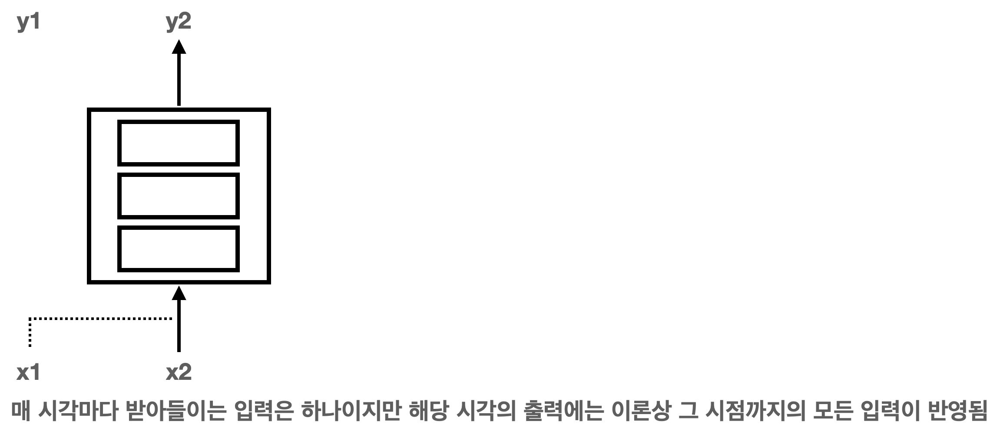
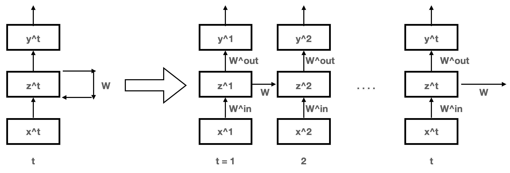

# RNN
재귀 신경망(RNN)은 음성이나 언어, 동영상과 같은 연속열 데이터를 다루는 신경망

- 데이터는 일반적으로 그 길이가 샘플마다 무척 다르며 연속열 내의 요소의 순서(문맥)에 의미가 있는 것이 특징

## 연속열 데이터의 분류
- 연속열 데이터란 각각의 요소에 순서가 있는 모임으로 음성, 동영상, 텍스트 등이 있음

## RNN의 구조
- 재귀 신경망(RNN)은 내부에 (방향이 있는) 순환경로를 가진 신경망을 통틀어 부르는 말로 그러한 구조 덕에 정보를 일시적으로 기억하고 그에 따라 반응을 동적으로 변화 가능
- 그로 인해 연속열 데이터 안에 존재하는 '문맥'을 포착하고 분류 문제도 잘 처리 가능
- RNN의 동작은 각각의 시각 t마다 하나의 입력 X^t를 입력받아 또 동시에 하나의 출력 y^t를 출력하는 것
- 신경망 내부에 있는 귀환로에 의해 출력을 계산할 때 RNN이 이전에 입력받은 모든 입력(입력의 히스토리)이 관여
- RNN은 이론상 과거의 모든 입력에 대해 하나의 출력을 내놓는 매핑을 모형화

 

- 연속열 데이터 전체가 일괄로 주어진 경우 그 연속열 데이터를 역순으로 RNN에 입력하는 것도 가능
- 원래 순서대로 연속열을 입력받는 RNN과 역순으로 연속열을 입력받는 RNN을 만들어 양쪽의 출력층을 통합해 구성한 신경망을 **양방향 RNN(bidirectional RNN)** 이라 함
  - 양방향 RNN이 정방향 입력만 주어지는 RNN보다 성능이 더 좋다고 알려짐

## 순전파 계산
- RNN의 귀환로는 중간층의 출력을 스스로의 입력으로 되돌리는 것으로 이 사이의 모든 유닛 간에 결합이 존재
- 이 귀환로로 들어오는 입력이 한 시각 전의 신호로 시각 t에 대한 중간층 각 유닛의 입력은 같은 시각에 입력층으로부터 전해지는 것과 시각 t - 1 에 중간층에서 나온 출력이 피드백된 것의 합

## 역전파 계산
- RNN을 학습하는 데는 앞먹임 신경망과 같이 SGD를 사용, 어떤 경우든 각 층의 가중치에 대한 오차의 미분을 계산
  - **RTRL(RealTime Recurrent Learning)**
    - 메모리 효율이 좋음
  - **BPTT(BackPropagation Through Time)**
    - 계산속도가 빠르며 간단

- BPTT는 RNN을 시간 방향으로 펼쳐 앞먹임 신경망과 같은 형태로 만든 후 역전파 계산을 수행
  - 시간 방향으로 펼친다는 것은 매 시각마다의 RNN의 각 층이 별개인 것처럼 간주 

 

## 장단기기억
### RNN의 기울기 소실 문제
- RNN의 경우 포착할 수 있는 문맥의 길이, 즉 현재 시각으로부터 얼마나 먼 과거의 입력까지 반영할 수 있는지가 중요
  - 이론상으론 과거의 모든 입력 이력이 고려되어야 할테지만 실제 RNN의 출력에 반영시킬 수 있는 것은 기껏해야 과거 10시각 정도로 알려져 있음
- 이러한 한계는 앞먹임 신경망의 기울기 소실 문제와 같은 원인에서 비롯
- 층수가 많은 신경망에는 역전파법으로 기울기를 계산시 층을 거슬러 올라감에 따라 기울기 값이 폭발적으로 커지거나 0으로 소멸해 버리기 쉬운 성질 존재
  - RNN의 역전파 계산은 시간 방향으로 전개되므로 층수가 매우 많은 앞먹임 신경망의 역전파 계산으로 바꿔 생각할 수 있음 ==> RNN의 본래 층수가 적다 해도 역전파 계산 시에는 많은 층수를 다루는 것과 마찬가지 그에 따라 기울기 값도 발산하거나 소멸하거나 둘 중 하나가 되기 쉬움
- RNN으로는 단기적 기억은 실현할 수 있지만 더 장기적 기억을 실현하는 것은 어려움

## LSTM의 개요
RNN으론 장기적 기억 실현이 어려워 장기적 기억을 실현하기 위해 제안된 방법 중 가장 성공적 시도가 장단기기억(Long Short-Term Memory)
- LSTM은 RNN에 비해 중간층의 각 유닛이 메모리 유닛이라 불리는 요소로 구성된 구조로 그 외의 구조는 기존 RNN과 같음

## 입력과 출력의 연속열 길이가 다른 경우
### 은닉 마르코프 모델
- RNN(LSTM 포함)은 각 시각 t마다 하나의 입력 x^t를 받아 하나의 출력 y^t를 내놓음
  - 이 동작은 입력 연속열과 다른 길이를 가진 연속열을 추정해야 하는 경우엔 적합하지 않음
- **은닉 마르코프 모델(Hidden Markov Model, HMM)** 은 이러한 문제를 다루는 가장 일반적 방법
- HMM은 내부 상태를 숨겨진 변수로 가지고 이 변수가 시각과 함께 확률적으로 변화 동시에 HMM은 현재의 내부 상태에 기ㅗ한 확률적 관측을 생성

## 커넥셔니스트 시계열 분류(CTC)
- Connectionist Temporal Classification
- 입력과 출력 사이에 연속열의 길이가 서로 다른 경우의 분류 문제를 HMM을 쓰지 않고 신경망만을 사용해 해결하려는 방법
- CTC는 RNN의 출력에 대한 해석을 바꾸어 입력 연속열과 길이가 다른 출력 연속열을 다룰 수 있도록 해줌