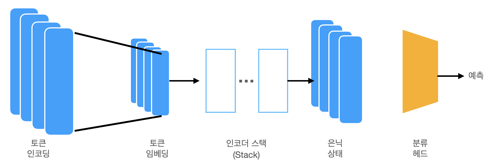
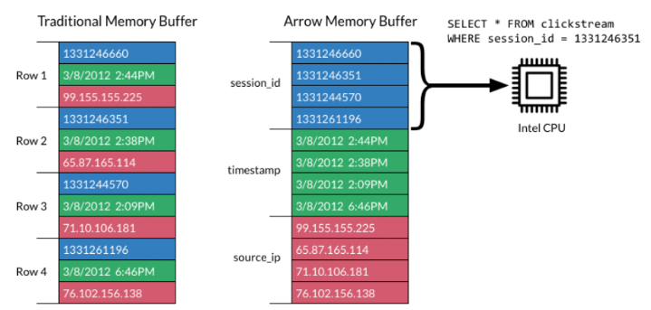
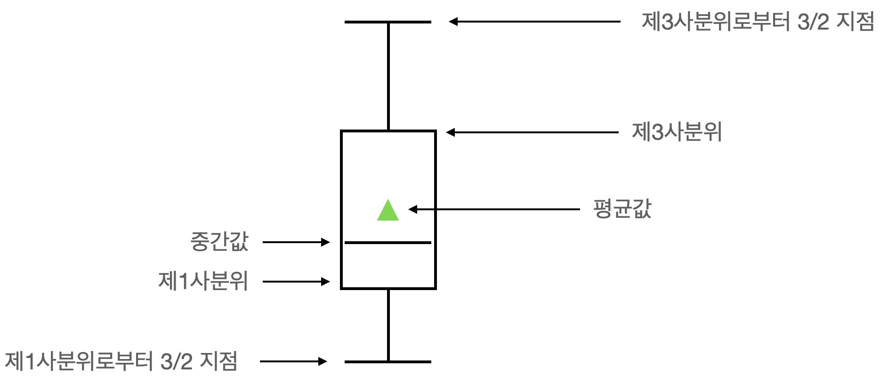
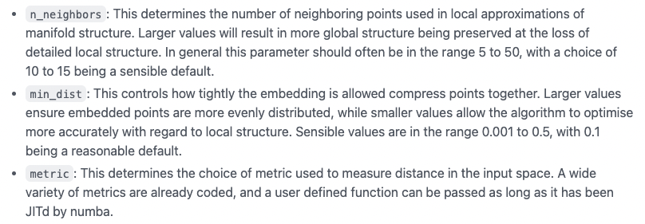
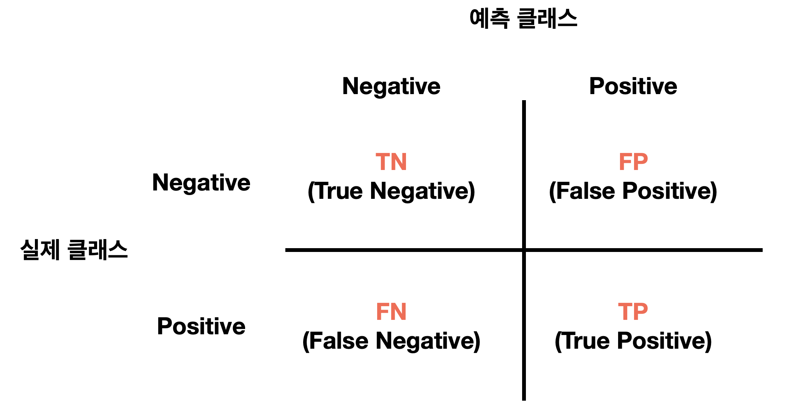

# Text Classification using DistilBERT
Huggingface의 DistilBERT(BERT와 비교해 성능은 비슷하지만 훨씬 작고 효율적) 모델을 사용해 6개의 감정 모델을 분류 <br>
Huggingface 생태계의 핵심 라이브러리 사용
- **데이터셋(Dataset)**
- **토크나이저(Tokenizer)**
- **트랜스포머스(Transformers)**

## 1. 데이터셋
### 허깅페이스 데이터셋 사용
- **list_datasets()** 함수를 사용하면 허브에서 제공하는 데이터셋 목록이 출력됨
- **load_dataset()** 함수로 데이터셋 로드 

### Huggingface hub에 데이터셋이 없는 경우
- 데이터셋은 로컬 데이터셋이나 원격 데이터셋에 사용 가능한 로딩 스크립트를 제공해줌
- 포멧에 따른 데이터셋 로딩 방법
    - CSV: load_dataset("csv", data_files="my_file.csv")
    - text: load_dataset("text", data_files="my_file.txt")
    - JSON: load_dataset("json", data_files="my_file.jsonl")
- 원격 데이터 로딩 방법
```
dataset_url = "https://www.~/train.txt"
!wget {dataset_url}
emotions_local = load_dataset("csv", data_files="train.txt", sep=";", names=["text", "label"])
```
구분자(sep)와 열 이름(names)을 지정
```
dataset_url = "https://www.~/train.txt"
emotions_local = load_dataset("csv", data_files=dataset_url, sep=";", names=["text", "label"])
```

### 데이터셋 to 데이터프레임
- Dataset 객체를 판다스 DataFrame으로 변환하게 되면 고수준 데이터 시각화 API 등 편리한 API를 사용할 수 있음 
- 데이터셋은 Dataset의 출력 포맷을 변경하는 **set_format()** 메서드를 제공

### 클래스 분포 확인
- 텍스트 분류 문제를 다룰땐 샘플의 클래스 분포 조사를 해야 함
- 클래스 분포가 편향된 데이터 셋은 훈련 손실과 평가 지표 측면에서 균형 잡힌 데이터셋과 다른 처리법이 필요
- pandas와 matplot을 이용하면 클래스 분포를 시각화할 수 있음

- 데이터셋이 불균형 한 경우 처리방법
    - 소수 클래스를 랜덤하게 오버샘플링(oversampling)
    - 다수 클래스를 랜덤하게 언더샘플링(undersampling)
    - 클래스의 대표성이 부족하다면 레이블된 데이터를 더 많이 수집 

- 훈련/테스트 분할을 만들기 전에는 샘플링 전략을 사용하면 안됨 그렇지 않으면 분할 사이에 많은 정보가 새어나감
    - 일반적으로 훈련 세트에만 샘플링 전략을 사용 
- 불균형한 클래스 분포에서의 샘플링 기법: https://imbalanced-learn.org/stable/

### 길이 확인
- 트랜스포머 모델은 **최대 문맥 크기(maximum context size)** 라는 최대 입력 시퀀스 길이가 존재
    - DistilBERT를 사용하는 애플리케이션에서 최대 문맥 크기는 512 토큰

## 2. 토큰나이저
- 토큰화란 문자열을 모델이 사용하는 기본 단위로 분할하는 단계

### 문자 토큰화
- 가장 간단한 토큰화 방법으로 각 문자를 개별로 모델에 주입하는 것
- 텍스트를 숫치 데이터로 변환한 후 one-hot vector의 2D 텐서로 변경
- one-hot vector는 machine learning에서 순서형(ordinal) 또는 명목형(nominal) 범주 데이터를 인코딩 하기 위해 자주 사용
    - 텍스트를 단순히 숫자로만 변경할시 이름 사이에 가상의 순서 또는 상관없는 관계가 생길수 있음
- 문자 토큰화는 철자 오류, 희귀단어 처리 등 장점이 있지만 단어 같은 언어 구조를 이 데이터에서 학습해야 한다는 큰 단점이 존재
    - 문자 수준의 토큰화는 거의 사용되지 않음

### 단어 토큰화
- 텍스트를 문자가 아닌 단어로 분할, 단어를 정수로 매핑
- 처음부터 단어를 사용하면 모델이 문자에서 단어를 학습하는 단계가 생략되어 훈련 과정의 복잡도가 감소함
- 단어 토큰화는 단어에 곡용, 활용형, 철자 오류가 포함되어 어휘사전이 금세 수백만 개까지 늘어나는 단점이 존재
    - 어휘 사전이 크면 신경망의 파라미터 역시 많이 필요해짐
    - 어휘사전의 크기를 제한하는 일반적 방법은 드물게 등장하는 단어는 무시
        - ex)말뭉치에서 자주 등장하는 10만개 단어만 사용 
    - but, 그렇게 되면 단어 토큰화 과정에서 중요 정보를 일부 잃게 됨

### 부분단어 토큰화
- 부분단어 토큰화는 문자 토큰화와 단어 토큰화의 장점을 결합
- 드물게 등장하는 단어를 더 작은 단위로 나누면 모델이 복잡한 단어나 철자 오류를 처리하기 용이
- 입력 길이를 적절한 크기로 유지하기 위해 자주 등장하는 단어를 고유 항목으로 유지
- NLP 에서 많이 사용되는 부분단어 토큰화는 BERT와 DistilBERT의 토큰나이저인 **WordPiece**
- 트랜스포머스는 사전 훈련된 모델에 연관된 토크나이저를 빠르게 로드하는 **AutoTokenizer** 클래스 제공
    - 이 클래스의 **from_pretrained()** 메서드를 허브의 모델ID나 로컬 파일 경로와 함께 호출
- AutoTokenizer 클래스는 체크포인트 이름을 사용해 모델의 설정, 사전 훈련 가중치, 어휘 사전을 자동으로 추출하는 자동 클래스

## 3. 텍스트 분류 모델 훈련
- DistilBERT 모델은 텍스트 시퀀스에 있는 마스킹된 단어를 예측하도록 사전 훈련, 이 모델을 바로 텍스트 분류에 사용하지는 못함


<br>

    - 토큰 인코딩(Token Encoding)
        - 텍스트를 토큰화 하여 Token-Encoding이라 부르는 one-hot 벡터로 나타냄
        - Tokenizer 어휘 사전의 크기(2만 ~ 2백만)가 토큰 인코딩의 차원을 결정
    - 토큰 임베딩(Token Embedding)
        - 토큰 인코딩을 저차원 공간의 벡터인 토큰 임베딩으로 변환
        - 토큰 임베딩을 Encoder 블록 층에 통과시켜 각 입력 토큰에 대한 은닉 상태를 생성
    - 각 은닉 상태는 언어 모델링의 사전 훈련 목표(DistilBERT의 경우 마스킹된 토큰)을 달성하기 위해 마스킹된 입력 토큰을 예측하는 층으로 보냄

- 텍스트 분류 모델 훈련 방법
    - 특성 추출
        - 사전 훈련된 모델을 수정하지 않고 은닉 상태를 특성(feature)으로 사용해 분류 모델을 훈련
    - 미세 튜닝
        - 사전 훈련된 모델의 파라미터도 업데이트하기 위해 전체 모델을 엔드-투-엔드로 훈련

### 트랜스포머를 특성 추출기로 사용
- 바디의 가중치를 동결하고 은닉 상태를 분류 모델의 특성으로 사용 
- 이 방식은 작거나 얕은 모델을 빠르게 훈련한다는 장점이 존재

### 사전 훈련된 모델 사용
- 트랜스포머스의 자동 클래스인 **AutoModel**을 사용
- AutoModel 클래스 또한 사전 훈련된 모델의 가중치를 로드하는 **from_pretrained()** 메서드 존재
- AutoModel은 토큰 인코딩을 임베딩으로 변환한 다음 인코더 스택에 통과시켜 은닉 상태를 반환
- 은닉 상태 텐서의 크기는 [batch_size, n_tokens, hidden_dim]
    - ex) [1, 6, 768]: 6개의 입력 토큰마다 768차원의 벡터가 반환
- 분류 작업에선 보통 [CLS] 토큰에 연관된 은닉 상태를 입력 특성으로 사용
    - BERT모델에 있는 [CLS]토큰은 분류 작업에서 전체 시퀀스의 정보가 담긴 특수 토큰

### 훈련 세트 시각화
- UMAP 알고리즘을 사용해 벡터를 2D로 투영
    - UMAP은 특성이 [0,1] 범위에 놓일 때 잘 동작함
    - Scikit-learn의 MinMaxScaler를 적용

## 트랜스포머 미세 튜닝
- 미세튜닝방식에서는 은닉 상태를 고정된 특성으로 사용하지 않고 전체 모델을 훈련
- 그렇기에 분류 헤드는 미분 가능해야 함(미분이 가능해야 역전파법으로 weight를 구할 수 있기 때문)
- 트랜스포머스의 **Trainer** API를 사용
- AutoModel 클래스 대신 AutoModelForSequenceClassification을 사용
    - 사전 훈련된 모델 출력위에 베이스 모델과 함께 쉽게 훈련할 수 있는 분류헤드가 존재
- 훈련 파라미터를 정의하기 위해 **TrainingArguments** 클래스를 사용
    - 많은 정보를 저장하며 훈련과 평가를 상세히 제어 가능
    - TrainingArguments Parameter
        - output_dir: Output Directory, 모델의 예측과 체크포인트를 저장해두는 장소
        - num_train_epochs: epochs 횟수
        - learning_rate: 학습률
        per_device_train_batch_size/ per_device_eval_batch_size: 배치크기
        - weight_decay: 가중치 감쇠 정도
        - evaluation_strategy: Training중 채택할 평가 전략
            - "no" : 학습하는 동안 평가 하지 않음
            - "steps" : eval_steps 마다 평가
            - "epoch" : epoch 당 평가
        - logging_steps: 업데이트 단계 수
        - save_strategy: 체크 포인트 저장 전략
            - "no": 저장하지 않음
            - "epoch": epoch 마다 저장
            - "steps": save_step마다 저장
        - load_best_model_at_end: 학습이 끝났을때 가장 best model을 load
        - 참고: https://huggingface.co/docs/transformers/v4.24.0/en/main_classes/trainer#transformers.TrainingArguments

## 오류 분석
- 모델의 손실 기준으로 검증 샘플을 정렬
- 정방향 패스의 결과와 레이블을 사용하면 손실을 자동 계산 가능

## CODE
colab을 사용해 실행
- colab/MotionClassifier.ipynb

## Reference
1. 아파치 애로우(Apache Arrow)
    - 서로 다른 데이터 인프라가 서로 간의 데이터 공유를 위해 API를 이용할때 발생하는 문제점 중 하나는 직렬화와 역직렬화의 오버헤드가 너무 높다는 것
    - Arrow는 언어, 플랫폼과 상관없이 메모리 상에서 컬럼 구조로 데이터를 정의하여 CPU, GPU에서 메모리를 빠르게 읽고 쓸 수 있도록 해줌

    <br>

2. 박스 플롯(Box Plot)
    - 많은 데이터를 눈으로 확인하기 어려울 때 그림을 이용해 데이터 집합의 범위와 중앙값을 빠르게 확인하는 목적으로 사용

    <br>

3. WordPiece
    - https://wikidocs.net/166826

4. Embedding Layer
    - 문자 입력에 대해 학습을 요할 때 필요 Layer
    - 단어를 의미론적 기하공간에 매핑할 수 있도록 벡터화 시킴

5. UMAP
    - 차원 축소 기술로 머신러닝 개발자들이 고차원 데이터셋을 이해하고 시각화하기 위해 사용하는 툴
    - umap 동작 원리: https://m.blog.naver.com/myohyun/222421460444
    - umap github: https://github.com/lmcinnes/umap
    - UMAP 생성자 파라미터

    
    <br>

6. 오차행렬(confused matrix)
    - 학습된 분류 모델이 예측을 수행하며 얼마나 햇갈리고(confused) 있는지도 함께 보여주는 지표

    
    <br>

    - True: 예측 클래스 값과 실제 클래스 값이 같음을 의미
    - False: 예측 클래스 값과 실제 클래스 값이 다름을 의미
    - Accuracy = (TN + TP) / (TN + FP + FN + TP)
    - 다중 클래스의 경우 자기 클래스는 Positive, 나머지는 모두 Negative로 처리

7. f1 점수
    - Precision(정밀도)
        - 모델이 True라고 분류한 것 중에 실제 True인 것의 비율
        - Precision = (TP) / (TP + FP)
    - Recall(재현율)
        - 실제 True인 것중에 모델이 True라고 예측한 것의 비율
        - Recall = (TP) / (TP + FN)
    - Ex] 날씨가 맑다/아니다를 예측
        - Precision: 날씨 예측 모델이 맑다로 예측했는데 실제 날씨가 맑았는지를 살펴보는 지표
        - Recall: 실제 날씨가 맑은 날중에서 모델이 맑다고 예측한 비율을 나타내는 지표
    - Precision, Recall은 모두 실제 True인 정답을 모델이 True라고 예측한 경우에 관심이 있으나 보는 관점이 다른 것
    - Accuracy(정확도)
        - True를 True로 False를 False라고 예측한 지표(Precision과 Recall은 True만 고려)
        - 그러나 Accuracy의 경우 데이터가 한쪽으로 편중될시 문제가 발생
            - 데이터가 한쪽으로 많이 쏠려 있을시 그 Data만 예측해도 정확도가 올라가게 됨
    - F1 Score
        - Precision과 Recall의 조화 평균
        - F1 Score = 2 * 1 / ((1/Precision) + (1/Recall))
        - F1 Score는 데이터 Label이 불균형 구조일 때 모델의 성능을 정확히 평가, 성능을 하나의 숫자로 표현이 가능 

    - https://sumniya.tistory.com/26